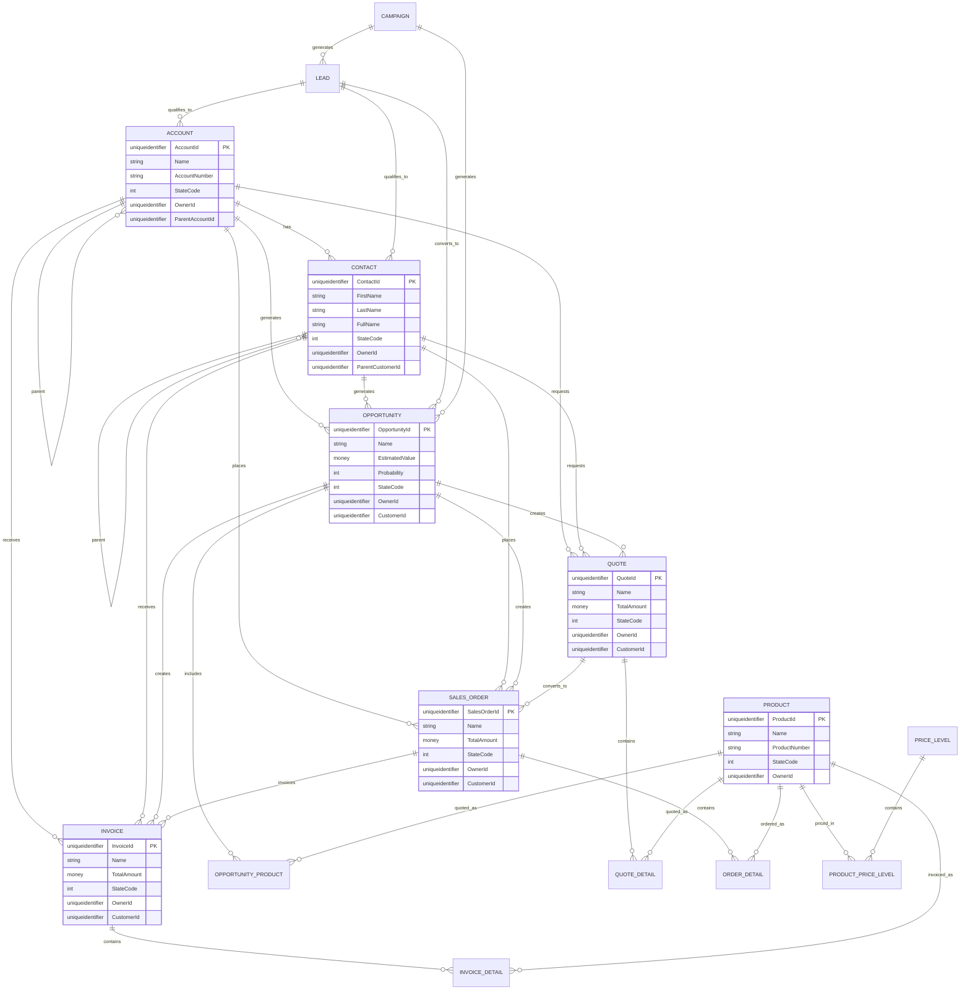
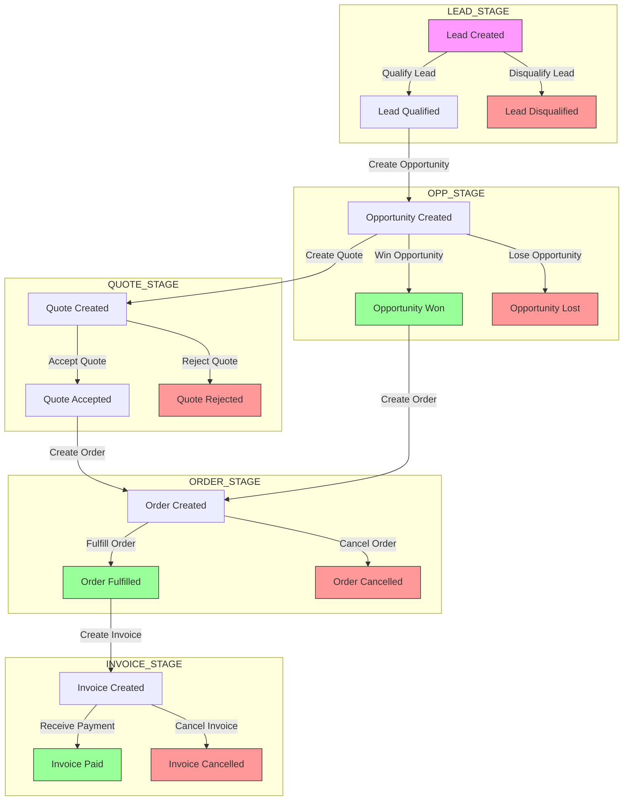
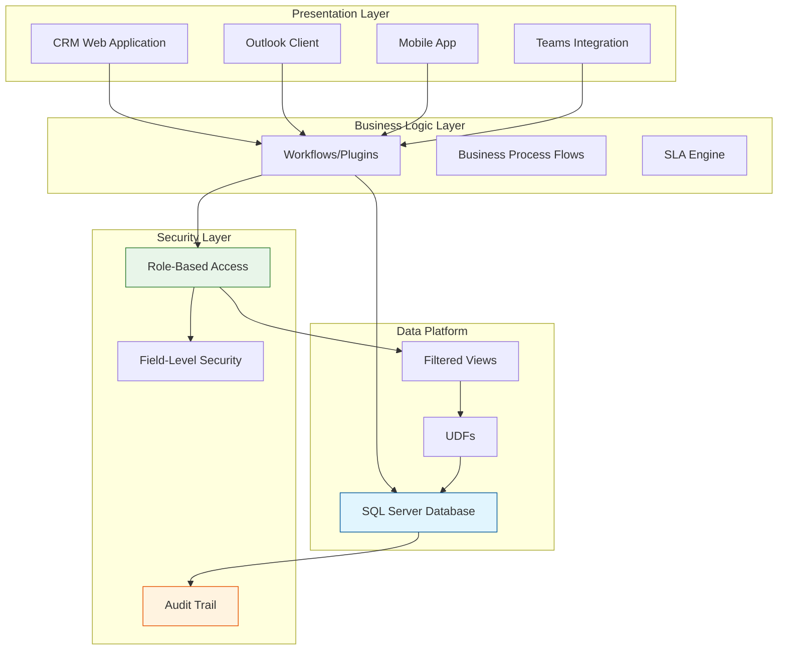

# Microsoft Dynamics 365 CRM Database Technical Architecture Documentation

## Comprehensive Technical Analysis Report

**Database Name:** CANCRM_MSCRM  
**Platform:** Microsoft SQL Server / Microsoft Dynamics 365 Dataverse  
**Analysis Date:** 2026-02-25  
**Document Version:** 1.0

---

## Table of Contents

1. [Executive Summary](#1-executive-summary)
2. [Database Data Structure](#2-database-data-structure)
3. [Entity Relationship Architecture](#3-entity-relationship-architecture)
4. [Business Data Flow](#4-business-data-flow)
5. [Data Flow Explanation](#5-data-flow-explanation)
6. [Validation & Business Rules](#6-validation--business-rules)
7. [Security Architecture](#7-security-architecture)
8. [Performance Analysis](#8-performance-analysis)
9. [Mermaid Diagrams](#9-mermaid-diagrams)
10. [Recommendations](#10-recommendations)

---

## 1. Executive Summary

This document provides a comprehensive technical analysis of the Microsoft Dynamics 365 CRM database schema (`CANCRM_MSCRM`). The database implements a complete Sales module architecture with entities for managing Leads, Accounts, Contacts, Opportunities, Quotes, Orders, Invoices, and supporting entities like Products, Price Lists, Campaigns, and Activities.

**Key Findings:**
- **Total Tables Identified:** 150+ base tables
- **Core Sales Entities:** 14 primary entities
- **Custom Entities:** Multiple custom entities (canven_onboarding, canven_propertyonboard, new_customercomplaint, etc.)
- **Security Model:** Role-based with Business Unit, Team, and User ownership
- **Data Consistency:** Referential integrity enforced through cascade delete rules

---

## 2. Database Data Structure

### 2.1 Core Sales Entities Overview

| Entity | Table Name | Object Type Code | Primary Key | Purpose |
|--------|------------|-----------------|-------------|---------|
| Account | AccountBase | 1 | AccountId | Business accounts/organizations |
| Contact | ContactBase | 2 | ContactId | Individual contacts |
| Lead | LeadBase | 4 | LeadId | Sales leads/prospects |
| Opportunity | OpportunityBase | 3 | OpportunityId | Sales opportunities |
| Quote | QuoteBase | 1084 | QuoteId | Sales quotations |
| Sales Order | SalesOrderBase | 1088 | SalesOrderId | Customer orders |
| Invoice | InvoiceBase | 1090 | SalesInvoices | Billing documents |
| Product | ProductBase | 1024 | ProductId | Products and services |
| Price List | PriceLevelBase | 1022 | PriceLevelId | Pricing schedules |
| Campaign | CampaignBase | 4400 | CampaignId | Marketing campaigns |
| Case/Incident | IncidentBase | 112 | IncidentId | Service cases |
| Contract | ContractBase | 1010 | ContractId | Service agreements |

### 2.2 Account Table (AccountBase)

**Purpose:** Stores business account/organization records

**Primary Key:** AccountId (uniqueidentifier)

```sql
CREATE TABLE [dbo].[AccountBase](
    [AccountId] [uniqueidentifier] NOT NULL,  -- Primary Key
    [Name] [nvarchar](160) NULL,              -- Account name (indexed for search)
    [AccountNumber] [nvarchar](20) NULL,      -- Business account number
    [AccountCategoryCode] [int] NULL,         -- Category classification
    [CustomerSizeCode] [int] NULL,            -- Size classification (Enterprise, SMB)
    [CustomerTypeCode] [int] NULL,           -- Type (Customer, Competitor, Partner)
    [AccountRatingCode] [int] NULL,          -- Rating (Hot, Warm, Cold)
    [IndustryCode] [int] NULL,               -- Industry classification
    [TerritoryCode] [int] NULL,              -- Territory assignment
    [Revenue] [money] NULL,                   -- Annual revenue
    [NumberOfEmployees] [int] NULL,          -- Employee count
    [OwnershipCode] [int] NULL,              -- Ownership type
    [WebSiteURL] [nvarchar](200) NULL,       -- Website URL
    
    -- Contact Information
    [EMailAddress1] [nvarchar](100) NULL,
    [Telephone1] [nvarchar](50) NULL,
    [Fax] [nvarchar](50) NULL,
    
    -- Address
    [Address1_Line1] [nvarchar](250) NULL,
    [Address1_City] [nvarchar](80) NULL,
    [Address1_StateOrProvince] [nvarchar](50) NULL,
    [Address1_PostalCode] [nvarchar](20) NULL,
    [Address1_Country] [nvarchar](100) NULL,
    
    -- Ownership & Security
    [OwnerId] [uniqueidentifier] NOT NULL,
    [OwnerIdType] [int] NOT NULL,            -- 8=User, 9=Team
    [OwningBusinessUnit] [uniqueidentifier] NULL,
    
    -- State Management
    [StateCode] [int] NOT NULL,             -- 0=Active, 1=Inactive
    [StatusCode] [int] NULL,
    
    -- Audit Fields
    [CreatedOn] [datetime] NULL,
    [CreatedBy] [uniqueidentifier] NULL,
    [ModifiedOn] [datetime] NULL,
    [ModifiedBy] [uniqueidentifier] NULL,
    
    -- Hierarchy
    [ParentAccountId] [uniqueidentifier] NULL,  -- Self-referencing FK
    
    CONSTRAINT [ndx_PrimaryKey_Account] PRIMARY KEY CLUSTERED (AccountId)
)
```

**Indexes:**
- Primary: AccountId (Clustered)
- Non-clustered: Name, AccountNumber, OwnerId, OwningBusinessUnit, StateCode

**Unique Constraints:**
- AccountNumber (optional unique)

### 2.3 Contact Table (ContactBase)

**Purpose:** Stores individual contact/person records

**Primary Key:** ContactId (uniqueidentifier)

```sql
CREATE TABLE [dbo].[ContactBase](
    [ContactId] [uniqueidentifier] NOT NULL,  -- Primary Key
    [FirstName] [nvarchar](50) NULL,
    [MiddleName] [nvarchar](50) NULL,
    [LastName] [nvarchar](50) NULL,
    [FullName] [nvarchar](160) NULL,          -- Computed: First + Middle + Last
    [YomiFirstName] [nvarchar](50) NULL,       -- Phonetic reading (Japanese)
    [YomiLastName] [nvarchar](50) NULL,
    [EMailAddress1] [nvarchar](100) NULL,
    [Telephone1] [nvarchar](50) NULL,
    [MobilePhone] [nvarchar](50) NULL,
    [JobTitle] [nvarchar](100) NULL,
    
    -- Parent Customer ( polymorphic - can be Account or Contact)
    [ParentCustomerId] [uniqueidentifier] NULL,
    [ParentCustomerIdType] [int] NULL,        -- 1=Account, 2=Contact
    
    -- Ownership & Security
    [OwnerId] [uniqueidentifier] NOT NULL,
    [OwnerIdType] [int] NOT NULL,
    [OwningBusinessUnit] [uniqueidentifier] NULL,
    
    -- State Management
    [StateCode] [int] NOT NULL,
    [StatusCode] [int] NULL,
    
    -- Audit Fields
    [CreatedOn] [datetime] NULL,
    [CreatedBy] [uniqueidentifier] NULL,
    [ModifiedOn] [datetime] NULL,
    [ModifiedBy] [uniqueidentifier] NULL,
    
    -- Master Record (for duplicate merging)
    [MasterId] [uniqueidentifier] NULL,
    
    CONSTRAINT [ndx_PrimaryKey_Contact] PRIMARY KEY CLUSTERED (ContactId)
)
```

### 2.4 Lead Table (LeadBase)

**Purpose:** Stores prospective customer information before qualification

**Primary Key:** LeadId (uniqueidentifier)

```sql
CREATE TABLE [dbo].[LeadBase](
    [LeadId] [uniqueidentifier] NOT NULL,
    [Subject] [nvarchar](200) NULL,
    [LastName] [nvarchar](50) NULL,
    [FirstName] [nvarchar](50) NULL,
    [CompanyName] [nvarchar](100) NULL,
    [EMailAddress1] [nvarchar](100) NULL,
    [Telephone1] [nvarchar](50) NULL,
    
    -- Lead Qualification Status
    [StateCode] [int] NOT NULL,             -- 0=Open, 1=Qualified, 2=Disqualified
    [StatusCode] [int] NULL,                 -- Reason for current state
    
    -- Qualification Data (populated on qualification)
    [QualifiedFromContactId] [uniqueidentifier] NULL,  -- Converted to Contact
    [QualifiedFromAccountId] [uniqueidentifier] NULL,   -- Converted to Account
    
    -- Interest Classification
    [LeadSourceCode] [int] NULL,            -- Source: Advertisement, Campaign, Employee, etc.
    [RatingCode] [int] NULL,                -- Hot, Warm, Cold
    
    -- Budget & Timeline
    [EstimatedAmount] [money] NULL,
    [EstimatedCloseDate] [datetime] NULL,
    [PurchaseTimeframeCode] [int] NULL,      -- Immediate, This Quarter, This Year
    [PurchaseProcessCode] [int] NULL,        -- Individual, Committee, Everyone
    
    -- Ownership
    [OwnerId] [uniqueidentifier] NOT NULL,
    [OwnerIdType] [int] NOT NULL,
    [OwningBusinessUnit] [uniqueidentifier] NULL,
    
    -- Campaign Association
    [CampaignId] [uniqueidentifier] NULL,    -- Originating campaign
    
    -- Audit
    [CreatedOn] [datetime] NULL,
    [CreatedBy] [uniqueidentifier] NULL,
    [ModifiedOn] [datetime] NULL,
    [ModifiedBy] [uniqueidentifier] NULL,
    
    CONSTRAINT [ndx_PrimaryKey_Lead] PRIMARY KEY CLUSTERED (LeadId)
)
```

### 2.5 Opportunity Table (OpportunityBase)

**Purpose:** Stores qualified sales opportunities

**Primary Key:** OpportunityId (uniqueidentifier)

```sql
CREATE TABLE [dbo].[OpportunityBase](
    [OpportunityId] [uniqueidentifier] NOT NULL,
    [Name] [nvarchar](200) NULL,             -- Opportunity name
    
    -- Customer (polymorphic: Account or Contact)
    [CustomerId] [uniqueidentifier] NULL,
    [CustomerIdType] [int] NULL,             -- 1=Account, 2=Contact
    
    -- Sales Information
    [EstimatedValue] [money] NULL,
    [EstimatedRevenue] [money] NULL,
    [ActualValue] [money] NULL,               -- Won value
    
    -- Probability & Status
    [Probability] [int] NULL,                 -- 0-100%
    [StepId] [uniqueidentifier] NULL,         -- Current sales stage
    [StepName] [nvarchar](100) NULL,
    
    -- Timeline
    [EstimatedCloseDate] [datetime] NULL,
    [ActualCloseDate] [datetime] NULL,        -- Actual close date
    
    -- Status
    [StateCode] [int] NOT NULL,             -- 0=Open, 1=Won, 2=Lost
    [StatusCode] [int] NULL,
    
    -- Resolution (for Won/Lost)
    [ClosedReasonCode] [int] NULL,
    [CompetitorId] [uniqueidentifier] NULL,  -- If lost
    
    -- Price List
    [PriceLevelId] [uniqueidentifier] NULL,  -- Pricing to use
    
    -- Currency
    [TransactionCurrencyId] [uniqueidentifier] NULL,
    [ExchangeRate] [decimal](23, 10) NULL,
    
    -- Ownership
    [OwnerId] [uniqueidentifier] NOT NULL,
    [OwnerIdType] [int] NOT NULL,
    [OwningBusinessUnit] [uniqueidentifier] NULL,
    
    -- Originating Lead (if converted from Lead)
    [OriginatingLeadId] [uniqueidentifier] NULL,
    
    -- Campaign
    [CampaignId] [uniqueidentifier] NULL,
    
    -- Audit
    [CreatedOn] [datetime] NULL,
    [CreatedBy] [uniqueidentifier] NULL,
    [ModifiedOn] [datetime] NULL,
    [ModifiedBy] [uniqueidentifier] NULL,
    
    CONSTRAINT [ndx_PrimaryKey_Opportunity] PRIMARY KEY CLUSTERED (OpportunityId)
)
```

### 2.6 Quote Table (QuoteBase)

**Purpose:** Stores pre-sales quotations/proposals

**Primary Key:** QuoteId (uniqueidentifier)

```sql
CREATE TABLE [dbo].[QuoteBase](
    [QuoteId] [uniqueidentifier] NOT NULL,
    [Name] [nvarchar](200) NULL,
    [QuoteNumber] [nvarchar](100) NULL,       -- Auto-generated
    
    -- Customer
    [CustomerId] [uniqueidentifier] NULL,
    [CustomerIdType] [int] NULL,
    
    -- Opportunity (if from opportunity)
    [OpportunityId] [uniqueidentifier] NULL,
    
    -- Pricing
    [PriceLevelId] [uniqueidentifier] NULL,
    [TotalAmount] [money] NULL,                -- Calculated: sum of details + tax
    [TotalAmount_Base] [money] NULL,           -- Base currency
    [DiscountAmount] [money] NULL,
    [DiscountPercentage] [decimal](5, 2) NULL,
    
    -- Dates
    [EffectiveFrom] [datetime] NULL,           -- Valid from
    [EffectiveTo] [datetime] NULL,             -- Valid until
    [ClosedDate] [datetime] NULL,               -- If accepted/rejected
    
    -- Status
    [StateCode] [int] NOT NULL,               -- 0=Open, 1=Won, 2=Lost
    [StatusCode] [int] NULL,
    
    -- Currency
    [TransactionCurrencyId] [uniqueidentifier] NULL,
    [ExchangeRate] [decimal](23, 10) NULL,
    
    -- Ownership
    [OwnerId] [uniqueidentifier] NOT NULL,
    [OwnerIdType] [int] NOT NULL,
    [OwningBusinessUnit] [uniqueidentifier] NULL,
    
    -- Sales Order (if converted)
    [SalesOrderId] [uniqueidentifier] NULL,
    
    -- Audit
    [CreatedOn] [datetime] NULL,
    [CreatedBy] [uniqueidentifier] NULL,
    [ModifiedOn] [datetime] NULL,
    [ModifiedBy] [uniqueidentifier] NULL,
    
    CONSTRAINT [ndx_PrimaryKey_Quote] PRIMARY KEY CLUSTERED (QuoteId)
)
```

### 2.7 Sales Order Table (SalesOrderBase)

**Purpose:** Stores confirmed customer orders

**Primary Key:** SalesOrderId (uniqueidentifier)

```sql
CREATE TABLE [dbo].[SalesOrderBase](
    [SalesOrderId] [uniqueidentifier] NOT NULL,
    [Name] [nvarchar](200) NULL,
    [OrderNumber] [nvarchar](100) NULL,        -- Auto-generated
    
    -- Customer
    [CustomerId] [uniqueidentifier] NULL,
    [CustomerIdType] [int] NULL,
    
    -- Opportunity (if from opportunity)
    [OpportunityId] [uniqueidentifier] NULL,
    
    -- Quote (if from quote)
    [QuoteId] [uniqueidentifier] NULL,
    
    -- Pricing
    [PriceLevelId] [uniqueidentifier] NULL,
    [TotalAmount] [money] NULL,
    [TotalAmount_Base] [money] NULL,
    [DiscountAmount] [money] NULL,
    [DiscountPercentage] [decimal](5, 2) NULL,
    [FreightAmount] [money] NULL,
    
    -- Dates
    [OrderDate] [datetime] NULL,
    [EffectiveFrom] [datetime] NULL,
    [RequestDeliveryBy] [datetime] NULL,
    
    -- Shipping
    [ShippingMethodCode] [int] NULL,
    [ShipTo_Name] [nvarchar](200) NULL,
    [ShipTo_Line1] [nvarchar](250) NULL,
    [ShipTo_City] [nvarchar](80) NULL,
    [ShipTo_StateOrProvince] [nvarchar](50) NULL,
    [ShipTo_PostalCode] [nvarchar](20) NULL,
    [ShipTo_Country] [nvarchar](100) NULL,
    
    -- Billing (Bill To)
    [BillTo_Name] [nvarchar](200) NULL,
    [BillTo_Line1] [nvarchar](250) NULL,
    [BillTo_City] [nvarchar](80) NULL,
    [BillTo_StateOrProvince] [nvarchar](50) NULL,
    [BillTo_PostalCode] [nvarchar](20) NULL,
    [BillTo_Country] [nvarchar](100) NULL,
    
    -- Status
    [StateCode] [int] NOT NULL,              -- 0=Active, 1=Submitted, 2=Cancelled, 3=Fulfilled, 4=Invoiced
    [StatusCode] [int] NULL,
    
    -- Invoice (if invoiced)
    [InvoiceId] [uniqueidentifier] NULL,
    
    -- Currency
    [TransactionCurrencyId] [uniqueidentifier] NULL,
    [ExchangeRate] [decimal](23, 10) NULL,
    
    -- Ownership
    [OwnerId] [uniqueidentifier] NOT NULL,
    [OwnerIdType] [int] NOT NULL,
    [OwningBusinessUnit] [uniqueidentifier] NULL,
    
    -- Audit
    [CreatedOn] [datetime] NULL,
    [CreatedBy] [uniqueidentifier] NULL,
    [ModifiedOn] [datetime] NULL,
    [ModifiedBy] [uniqueidentifier] NULL,
    
    CONSTRAINT [ndx_PrimaryKey_SalesOrder] PRIMARY KEY CLUSTERED (SalesOrderId)
)
```

### 2.8 Invoice Table (InvoiceBase)

**Purpose:** Stores billing/invoicing documents

**Primary Key:** InvoiceId (uniqueidentifier)

```sql
CREATE TABLE [dbo].[InvoiceBase](
    [InvoiceId] [uniqueidentifier] NOT NULL,
    [Name] [nvarchar](200) NULL,
    [InvoiceNumber] [nvarchar](100) NULL,      -- Auto-generated
    
    -- Customer
    [CustomerId] [uniqueidentifier] NULL,
    [CustomerIdType] [int] NULL,
    
    -- Sales Order (source order)
    [SalesOrderId] [uniqueidentifier] NULL,
    
    -- Pricing
    [PriceLevelId] [uniqueidentifier] NULL,
    [TotalAmount] [money] NULL,
    [TotalAmount_Base] [money] NULL,
    [DiscountAmount] [money] NULL,
    [DiscountPercentage] [decimal](5, 2) NULL,
    [FreightAmount] [money] NULL,
    [TaxAmount] [money] NULL,
    
    -- Dates
    [InvoiceDate] [datetime] NULL,
    [DueDate] [datetime] NULL,
    [PaymentTermsCode] [int] NULL,           -- Net 30, Net 60, etc.
    
    -- Status
    [StateCode] [int] NOT NULL,              -- 0=Active, 1=Paid, 2=Cancelled, 3=Partial
    [StatusCode] [int] NULL,
    
    -- Currency
    [TransactionCurrencyId] [uniqueidentifier] NULL,
    [ExchangeRate] [decimal](23, 10) NULL,
    
    -- Ownership
    [OwnerId] [uniqueidentifier] NOT NULL,
    [OwnerIdType] [int] NOT NULL,
    [OwningBusinessUnit] [uniqueidentifier] NULL,
    
    -- Billing/Shipping addresses (from Order or explicit)
    [BillTo_Name] [nvarchar](200) NULL,
    [ShipTo_Name] [nvarchar](200) NULL,
    [ShipTo_Address] ...,
    
    -- Audit
    [CreatedOn] [datetime] NULL,
    [CreatedBy] [uniqueidentifier] NULL,
    [ModifiedOn] [datetime] NULL,
    [ModifiedBy] [uniqueidentifier] NULL,
    
    CONSTRAINT [ndx_PrimaryKey_Invoice] PRIMARY KEY CLUSTERED (InvoiceId)
)
```

### 2.9 Order Detail Table (SalesOrderDetailBase)

**Purpose:** Line items for sales orders

**Primary Key:** SalesOrderDetailId (uniqueidentifier)

```sql
CREATE TABLE [dbo].[SalesOrderDetailBase](
    [SalesOrderDetailId] [uniqueidentifier] NOT NULL,
    [SalesOrderId] [uniqueidentifier] NOT NULL,  -- FK to Order
    
    -- Product
    [ProductId] [uniqueidentifier] NULL,
    [ProductName] [nvarchar](100) NULL,
    [Sku] [nvarchar](100) NULL,
    
    -- Quantity & Pricing
    [Quantity] [decimal](5, 2) NULL,
    [Unit] [nvarchar](50) NULL,
    [UnitPrice] [money] NULL,
    [UnitPrice_Base] [money] NULL,
    [ExtendedAmount] [money] NULL,
    [ExtendedAmount_Base] [money] NULL,
    
    -- Discount
    [DiscountAmount] [money] NULL,
    [DiscountPercentage] [decimal](5, 2) NULL,
    
    -- Tax
    [TaxAmount] [money] NULL,
    
    -- Status
    [StateCode] [int] NOT NULL,              -- 0=Active, 1=Fulfilled
    [StatusCode] [int] NULL,
    
    -- Ship Date
    [ShipDate] [datetime] NULL,
    
    -- Ownership
    [OwnerId] [uniqueidentifier] NOT NULL,
    [OwnerIdType] [int] NOT NULL,
    
    -- Currency
    [TransactionCurrencyId] [uniqueidentifier] NULL,
    [ExchangeRate] [decimal](23, 10) NULL,
    
    -- Audit
    [CreatedOn] [datetime] NULL,
    [CreatedBy] [uniqueidentifier] NULL,
    [ModifiedOn] [datetime] NULL,
    [ModifiedBy] [uniqueidentifier] NULL,
    
    CONSTRAINT [ndx_PrimaryKey_SalesOrderDetail] PRIMARY KEY CLUSTERED (SalesOrderDetailId)
)
```

### 2.10 Product Table (ProductBase)

**Purpose:** Products, services, and product families

**Primary Key:** ProductId (uniqueidentifier)

```sql
CREATE TABLE [dbo].[ProductBase](
    [ProductId] [uniqueidentifier] NOT NULL,
    [Name] [nvarchar](200) NULL,
    [ProductNumber] [nvarchar](100) NULL,      -- SKU/Part Number
    [VendorName] [nvarchar](100) NULL,
    [VendorPartNumber] [nvarchar](100) NULL,
    
    -- Classification
    [ProductTypeCode] [int] NULL,             -- Product, Service, Family, Bundle
    [ProductSubCategory] [nvarchar](100) NULL,
    
    -- Pricing
    [DefaultUoMScheduleId] [uniqueidentifier] NULL,  -- Default unit of measure
    [DefaultUoMId] [uniqueidentifier] NULL,
    [Price] [money] NULL,                     -- List price
    [Cost] [money] NULL,                      -- Cost
    
    -- Inventory
    [QuantityOnHand] [decimal](8, 2) NULL,
    [CurrentCost] [money] NULL,
    [StandardCost] [money] NULL,
    
    -- Hierarchy
    [ParentProductId] [uniqueidentifier] NULL, -- For product families
    
    -- Status
    [StateCode] [int] NOT NULL,              -- 0=Active, 1=Retired
    [StatusCode] [int] NULL,
    
    -- Description
    [Description] [nvarchar](max) NULL,
    
    -- Ownership
    [OwnerId] [uniqueidentifier] NOT NULL,
    [OwnerIdType] [int] NOT NULL,
    [OwningBusinessUnit] [uniqueidentifier] NULL,
    
    -- Currency
    [TransactionCurrencyId] [uniqueidentifier] NULL,
    [ExchangeRate] [decimal](23, 10) NULL,
    
    -- Audit
    [CreatedOn] [datetime] NULL,
    [CreatedBy] [uniqueidentifier] NULL,
    [ModifiedOn] [datetime] NULL,
    [ModifiedBy] [uniqueidentifier] NULL,
    
    CONSTRAINT [ndx_PrimaryKey_Product] PRIMARY KEY CLUSTERED (ProductId)
)
```

### 2.11 Price List Table (PriceLevelBase)

**Purpose:** Pricing schedules for products

**Primary Key:** PriceLevelId (uniqueidentifier)

```sql
CREATE TABLE [dbo].[PriceLevelBase](
    [PriceLevelId] [uniqueidentifier] NOT NULL,
    [Name] [nvarchar](100) NULL,
    [Description] [nvarchar](max) NULL,
    
    -- Currency
    [TransactionCurrencyId] [uniqueidentifier] NOT NULL,
    
    -- Status
    [StateCode] [int] NOT NULL,              -- 0=Active, 1=Inactive
    [StatusCode] [int] NULL,
    
    -- Timing
    [BeginDate] [datetime] NULL,
    [EndDate] [datetime] NULL,
    
    -- Ownership
    [OwnerId] [uniqueidentifier] NOT NULL,
    [OwnerIdType] [int] NOT NULL,
    [OwningBusinessUnit] [uniqueidentifier] NULL,
    
    -- Audit
    [CreatedOn] [datetime] NULL,
    [CreatedBy] [uniqueidentifier] NULL,
    [ModifiedOn] [datetime] NULL,
    [ModifiedBy] [uniqueidentifier] NULL,
    
    CONSTRAINT [ndx_PrimaryKey_PriceLevel] PRIMARY KEY CLUSTERED (PriceLevelId)
)
```

### 2.12 Price List Item Table (ProductPriceLevelBase)

**Purpose:** Individual product prices within a price list

**Primary Key:** ProductPriceLevelId (uniqueidentifier)

```sql
CREATE TABLE [dbo].[ProductPriceLevelBase](
    [ProductPriceLevelId] [uniqueidentifier] NOT NULL,
    [PriceLevelId] [uniqueidentifier] NOT NULL,  -- FK to PriceList
    [ProductId] [uniqueidentifier] NOT NULL,       -- FK to Product
    
    -- Pricing
    [Amount] [money] NULL,                       -- Unit price
    [Amount_Base] [money] NULL,
    [RoundingPolicyCode] [int] NULL,             -- Round up, down, etc.
    [RoundingOption] [int] NULL,
    [RoundingAmount] [money] NULL,
    
    -- Unit of Measure
    [UoMId] [uniqueidentifier] NULL,               -- Unit of measure
    
    -- Status
    [StateCode] [int] NOT NULL,
    [StatusCode] [int] NULL,
    
    -- Currency
    [TransactionCurrencyId] [uniqueidentifier] NOT NULL,
    
    -- Audit
    [CreatedOn] [datetime] NULL,
    [CreatedBy] [uniqueidentifier] NULL,
    [ModifiedOn] [datetime] NULL,
    [ModifiedBy] [uniqueidentifier] NULL,
    
    CONSTRAINT [ndx_PrimaryKey_ProductPriceLevel] PRIMARY KEY CLUSTERED (ProductPriceLevelId)
)
```

### 2.13 Supporting Tables

**TransactionCurrencyBase**
- Stores currency definitions
- Primary Key: TransactionCurrencyId
- Fields: CurrencyName, ISOCurrencyCode, CurrencySymbol, CurrencyPrecision, ExchangeRate

**UoMBase (Unit of Measure)**
- Stores unit of measure definitions
- Primary Key: UoMId
- Fields: Name, UoMScheduleId

**UoMScheduleBase**
- Groups for unit of measures
- Primary Key: UoMScheduleId

**TerritoryBase**
- Geographic segmentation
- Primary Key: TerritoryId

**BusinessUnitBase**
- Organization hierarchy
- Primary Key: BusinessUnitId
- Fields: Name, ParentBusinessUnitId (self-referencing)

**SystemUserBase**
- User definitions
- Primary Key: SystemUserId
- Fields: FullName, DomainName, BusinessUnitId, IsDisabled, AccessMode

**TeamBase**
- Team-based security
- Primary Key: TeamId

---

## 3. Entity Relationship Architecture

### 3.1 Relationship Overview

| Relationship | Parent Entity | Child Entity | Type | Cascade Delete |
|-------------|---------------|--------------|------|----------------|
| Account → Contact | Account | Contact | One-to-Many | Cascade |
| Account → Opportunity | Account | Opportunity | One-to-Many | Cascade |
| Account → Quote | Account | Quote | One-to-Many | Cascade |
| Account → Order | Account | SalesOrder | One-to-Many | Cascade |
| Account → Invoice | Account | Invoice | One-to-Many | Cascade |
| Account → Case | Account | Incident | One-to-Many | Cascade |
| Contact → Opportunity | Contact | Opportunity | One-to-Many | Cascade |
| Contact → Quote | Contact | Quote | One-to-Many | Cascade |
| Contact → Order | Contact | SalesOrder | One-to-Many | Cascade |
| Lead → Contact | Lead | Contact | One-to-Many | Remove Link |
| Lead → Account | Lead | Account | One-to-Many | Remove Link |
| Lead → Opportunity | Lead | Opportunity | One-to-Many | Remove Link |
| Opportunity → Quote | Opportunity | Quote | One-to-Many | Cascade |
| Opportunity → Order | Opportunity | SalesOrder | One-to-Many | Cascade |
| Opportunity → Invoice | Opportunity | Invoice | One-to-Many | Cascade |
| Quote → Order | Quote | SalesOrder | One-to-Many | Cascade |
| Order → Invoice | SalesOrder | Invoice | One-to-Many | Cascade |
| Product → Price List Item | Product | ProductPriceLevel | One-to-Many | Remove Link |
| Price Level → Price List Item | PriceLevel | ProductPriceLevel | One-to-Many | Remove Link |
| Account → Child Account | Account | Account | One-to-Many | Cascade |
| Contact → Child Contact | Contact | Contact | One-to-Many | Cascade |

### 3.2 Junction Tables (Many-to-Many Relationships)

| Junction Table | Entity 1 | Entity 2 | Purpose |
|---------------|----------|----------|---------|
| AccountLeads | Account | Lead | Account-Lead association |
| ContactLeads | Contact | Lead | Contact-Lead association |
| AccountContacts | Account | Contact | Primary contact assignment |
| OpportunityCompetitors | Opportunity | Competitor | Competitor tracking |
| LeadCompetitors | Lead | Competitor | Competitor tracking |
| QuoteDetail | Quote | Product | Quote line items |
| OrderDetail | SalesOrder | Product | Order line items |
| InvoiceDetail | Invoice | Product | Invoice line items |
| OpportunityProduct | Opportunity | Product | Opportunity products |
| ProductSubstitute | Product | Product | Product substitutes |
| CampaignItem | Campaign | Multiple | Campaign targets |
| ListMember | List | Multiple | Marketing list members |

### 3.3 Cascade Delete Rules (from fn_CollectForCascadeDelete)

The database implements sophisticated cascade delete rules through the `fn_CollectForCascadeDelete` function:

**Cascade Actions:**
1. **Delete (4):** Child records are deleted when parent is deleted
2. **Remove Link (3):** Foreign key is set to NULL (nullable relationships)
3. **Restrict (255):** Prevents deletion if children exist (default for critical relationships)

**Key Cascade Rules:**

```sql
-- Account deletion cascades to:
-- 1. Child Accounts (AccountId → ParentAccountId)
-- 2. Contacts (CustomerId → Account)
-- 3. Opportunities (CustomerId → Account)
-- 4. Quotes (CustomerId → Account)
-- 5. Orders (CustomerId → Account)
-- 6. Invoices (CustomerId → Account)
-- 7. Cases/Incidents (CustomerId → Account)
-- 8. Contracts (CustomerId → Account)
-- 9. Activities (RegardingObjectId → Account)

-- Lead deletion cascades to:
-- 1. LeadAddresses
-- 2. ContactLeads
-- 3. LeadCompetitors
-- 4. AccountLeads
-- 5. LeadProducts

-- Opportunity deletion cascades to:
-- 1. OpportunityProducts
-- 2. OpportunityCompetitors
-- 3. Quotes (OpportunityId)
-- 4. Orders (OpportunityId)
-- 5. Invoices (OpportunityId)
-- 6. OpportunityClose (activity)

-- Quote deletion cascades to:
-- 1. QuoteDetails
-- 2. QuoteClose (activity)
-- 3. ContactQuotes

-- Order deletion cascades to:
-- 1. OrderDetails
-- 2. OrderClose (activity)
-- 3. ContactOrders
-- 4. Invoices (SalesOrderId)

-- Invoice deletion cascades to:
-- 1. InvoiceDetails
-- 2. ContactInvoices
```

---

## 4. Business Data Flow

### 4.1 Lead to Cash Sales Process Flow

```
┌─────────────────────────────────────────────────────────────────────────────────────────┐
│                         MICROSOFT DYNAMICS 365 CRM SALES PROCESS                       │
└─────────────────────────────────────────────────────────────────────────────────────────┘

    ┌──────────┐     ┌────────────┐     ┌─────────────┐     ┌────────┐     ┌──────────┐
    │   LEAD   │────▶│OPPORTUNITY │────▶│   QUOTE    │────▶│ ORDER  │────▶│ INVOICE │
    └──────────┘     └────────────┘     └─────────────┘     └────────┘     └──────────┘
         │                  │                  │                 │                │
         ▼                  ▼                  ▼                 ▼                ▼
    ┌──────────┐     ┌────────────┐     ┌─────────────┐     ┌────────┐     ┌──────────┐
    │ LeadBase │     │Opportunity │     │  QuoteBase │     │SalesOrd│     │ Invoice  │
    │          │     │   Base     │     │             │     │  erBase│     │   Base   │
    │LeadId    │     │Opportunity │     │  QuoteId   │     │OrderId │     │InvoiceId │
    │StateCode │     │  Id        │     │ QuoteId    │     │Sales   │     │ Invoice  │
    │0=Open    │     │CustomerId  │     │CustomerId  │     │OrderId │     │  Number  │
    │1=Qual   │     │Est.Value   │     │TotalAmount │     │Customer│     │ Customer │
    │2=Disq   │     │Probability │     │PriceLevel  │     │Id      │     │   Id     │
    │          │     │StepName    │     │StateCode   │     │Total   │     │TotalAmt  │
    │          │     │StateCode   │     │0=Open      │     │Amount  │     │DueDate   │
    │          │     │0=Open      │     │1=Won       │     │State   │     │StateCode │
    │          │     │1=Won       │     │2=Lost      │     │Code    │     │0=Active  │
    │          │     │2=Lost      │     │            │     │0=Active│     │1=Paid    │
    │          │     │            │     │            │     │1=Submit│     │2=Cancel  │
    │          │     │            │     │            │     │2=Cancel│     │          │
    └──────────┘     └────────────┘     └─────────────┘     └────────┘     └──────────┘
         │                  │                  │                 │                │
         ▼                  ▼                  ▼                 ▼                ▼
   Qualify/          Close/Won           Accept/            Fulfill         Receive
   Disqualify        Close/Lost          Close              Order           Payment
```

### 4.2 Stage-by-Stage Details

#### Stage 1: LEAD (LeadBase)

**Trigger for moving to next stage:** Qualify Lead action

**Status Field Usage:**
| StateCode | StatusCode | Description |
|-----------|------------|-------------|
| 0 (Open) | 1 | New |
| 0 | 2 | Contacted |
| 0 | 3 | Qualified |
| 0 | 4 | In Progress |
| 0 | 5 | Converted |
| 0 | 6 | Lost |
| 1 (Qualified) | 7 | In Progress |
| 1 | 8 | Won |
| 2 (Disqualified) | 9 | Cannot Contact |
| 2 | 10 | Lost |
| 2 | 11 | Not Interested |
| 2 | 12 | Already Enrolled |

**Required Fields for Qualification:**
- LastName (or CompanyName for B2B)
- Either AccountId or ContactId can be created during qualification

**Validation Rules:**
- Email format validation (if provided)
- Phone format validation
- Required field checks based on system settings

**Audit Tracking:**
- CreatedOn, CreatedBy
- ModifiedOn, ModifiedBy
- LeadSourceCode capture
- Qualification date tracking

#### Stage 2: OPPORTUNITY (OpportunityBase)

**Trigger for moving to next stage:** Create Quote / Close Opportunity

**Status Field Usage:**
| StateCode | StatusCode | Description |
|-----------|------------|-------------|
| 0 (Open) | 1 | New |
| 0 | 2 | In Progress |
| 0 | 3 | On Hold |
| 0 | 4 | Won |
| 0 | 5 | Lost |
| 1 (Won) | 6 | Won |
| 2 (Lost) | 7 | Cancelled |
| 2 | 8 | Out-Sold |
| 2 | 9 | Did not Budget |
| 2 | 10 | Lost to Competition |
| 2 | 11 | Not Our Customer |

**Required Fields:**
- CustomerId (Account or Contact)
- Name

**Validation Rules:**
- Probability: 0-100%
- EstimatedCloseDate: Must be future date
- PriceLevelId required for product-based opportunities

**Business Rules:**
- Quote can only be created from Open opportunity
- Closing with "Won" requires actual revenue value
- Closing with "Lost" requires CompetitorId or reason code

#### Stage 3: QUOTE (QuoteBase)

**Trigger for moving to next stage:** Accept Quote → Create Order

**Status Field Usage:**
| StateCode | StatusCode | Description |
|-----------|------------|-------------|
| 0 (Open) | 1 | Draft |
| 0 | 2 | Active |
| 0 | 3 | Revised |
| 0 | 4 | Inactivated |
| 1 (Won) | 5 | Accepted |
| 1 | 6 | Revised (Accepted) |
| 1 | 7 | Accepted (Converted to Order) |
| 2 (Lost) | 8 | Rejected |
| 2 | 9 | Superseded |

**Required Fields:**
- QuoteId (auto-generated)
- CustomerId
- PriceLevelId

**Validation Rules:**
- Quote detail lines must have ProductId or Description
- Quantity must be > 0
- EffectiveTo date must be >= EffectiveFrom
- TotalAmount auto-calculated from details

**Quote Detail (QuoteDetailBase):**
- Each line has UnitPrice, Quantity, Discount
- ExtendedAmount = (UnitPrice * Quantity) - Discount
- Multiple discounts: Percentage OR Amount, not both

#### Stage 4: SALES ORDER (SalesOrderBase)

**Trigger for moving to next stage:** Create Invoice / Fulfill Order

**Status Field Usage:**
| StateCode | StatusCode | Description |
|-----------|------------|-------------|
| 0 (Active) | 1 | New |
| 0 | 2 | Pending |
| 1 (Submitted) | 3 | Submitted |
| 1 | 4 | Partially Shipped |
| 2 (Cancelled) | 5 | Cancelled |
| 3 (Fulfilled) | 6 | Fulfilled |
| 4 (Invoiced) | 7 | Invoiced |

**Required Fields:**
- CustomerId
- PriceLevelId
- OrderDate

**Validation Rules:**
- All detail lines must be valid products
- Quantity available check (if inventory tracking enabled)
- Ship date must be >= Order date

**Business Rules:**
- Can be created from Accepted Quote (Quote → Order conversion)
- Can be manually created from Opportunity
- When Fulfilled, inventory is reduced

#### Stage 5: INVOICE (InvoiceBase)

**Trigger for moving to next stage:** Mark as Paid / Close

**Status Field Usage:**
| StateCode | StatusCode | Description |
|-----------|------------|-------------|
| 0 (Active) | 1 | New |
| 0 | 2 | Partial |
| 0 | 3 | Complete |
| 1 (Paid) | 4 | Paid |
| 2 (Cancelled) | 5 | Cancelled |

**Required Fields:**
- CustomerId
- InvoiceDate
- DueDate (calculated from PaymentTermsCode)

**Validation Rules:**
- PaymentTermsCode: 1=Net 30, 2=Net 60, 3=Net 90, 4=Due on Receipt
- DueDate = InvoiceDate + PaymentTerms days
- Cannot create invoice if Order is not Fulfilled (if configured)

**Business Rules:**
- Auto-generated Invoice Number (INV-YYYY-XXXXXX format)
- Can create from Fulfilled Order
- When Paid, revenue is recognized

---

## 5. Data Flow Explanation

### 5.1 Lead Qualification Flow

```
LeadBase                    ContactBase                 AccountBase
    │                            │                            │
    │ Qualify Lead              │                            │
    │───────────────────────────▶│                            │
    │ 1. Create Contact        │                            │
    │ 2. Create Account (B2B)  │─────────────────────────────▶│
    │ 3. Create Opportunity    │                            │
    │    with CustomerId        │                            │
    │                            │                            │
    │ Update Lead:              │                            │
    │ StateCode = 1 (Qualified)│                            │
    │ StatusCode = 7 (Converted)│                            │
```

**Foreign Key Enforcement:**
- Lead.QualifiedFromContactId → Contact.ContactId
- Lead.QualifiedFromAccountId → Account.AccountId
- Opportunity.CustomerId → Account.AccountId OR Contact.ContactId (polymorphic)

### 5.2 Quote to Order Flow

```
QuoteBase                 QuoteDetailBase           SalesOrderBase
   │                          │                          │
   │ Accept Quote             │                          │
   │─────────────────────────▶│                          │
   │ 1. Create Order         │                          │
   │ 2. Copy CustomerId      │─────────────────────────▶│
   │ 3. Copy PriceLevelId    │   1. Create Order      │
   │ 4. Calculate totals    │   2. Copy header data  │
   │ 5. Update StateCode=1   │   3. Set StateCode=0   │
   │                          │                          │
   │                          │  Copy from QuoteDetails │
   │                          │─────────────────────────▶│
   │                          │   For each QuoteDetail: │
   │                          │   1. Create OrderDetail │
   │                          │   2. Copy ProductId     │
   │                          │   3. Copy Quantity     │
   │                          │   4. Copy UnitPrice    │
   │                          │                          │
```

### 5.3 Transactional Dependencies

**Quote → Order → Invoice Chain:**

```sql
-- Order can only be created from Open or Won Quote
-- Quote StateCode: 0=Open, 1=Won, 2=Lost
IF EXISTS (SELECT 1 FROM QuoteBase WHERE QuoteId = @QuoteId AND StateCode IN (0, 1))
BEGIN
    -- Create Order
    INSERT INTO SalesOrderBase (SalesOrderId, ..., QuoteId)
    VALUES (NEWID(), ..., @QuoteId)
    
    -- Update Quote status
    UPDATE QuoteBase SET StateCode = 1, StatusCode = 7 WHERE QuoteId = @QuoteId
END

-- Invoice can only be created from Fulfilled Order
-- Order StateCode: 0=Active, 1=Submitted, 2=Cancelled, 3=Fulfilled, 4=Invoiced
IF EXISTS (SELECT 1 FROM SalesOrderBase WHERE SalesOrderId = @OrderId AND StateCode = 3)
BEGIN
    -- Create Invoice
    INSERT INTO InvoiceBase (InvoiceId, ..., SalesOrderId)
    VALUES (NEWID(), ..., @OrderId)
    
    -- Update Order status
    UPDATE SalesOrderBase SET StateCode = 4 WHERE SalesOrderId = @OrderId
END
```

### 5.4 Currency and Pricing Flow

```
PriceLevelBase ──────────────────────────────────────────────────────▶ QuoteBase
      │                                                               │
      │ (PriceLevelId)                                               │ (PriceLevelId)
      │                                                               │
      ▼                                                               ▼
ProductPriceLevelBase ────────────────────────────▶ QuoteDetailBase
      │                                               │
      │ (ProductId, PriceLevelId)                  │ (ProductId)
      │                                               │
      │ [ProductPriceLevel] =                      │
      │ ProductId + PriceLevelId                    │
      │                                               │
      │ [Amount] (Unit Price from Price List)      ▼
      │                                    Calculation:
      │ ┌─────────────────────────────────────────────────┐
      │ │ ExtendedAmount = Quantity × UnitPrice        │
      │ │              - DiscountAmount (if fixed)     │
      │ │              - (UnitPrice × Discount%)       │
      │ └─────────────────────────────────────────────────┘
      │                                    TotalAmount = SUM(ExtendedAmount)
      │                                                 + TaxAmount
      │                                                 + FreightAmount
```

---

## 6. Validation & Business Rules

### 6.1 Current Constraints

**Primary Key Constraints:**
- All tables have uniqueidentifier Primary Keys
- PK constraint enforced at database level

**Foreign Key Constraints:**
- Database uses application-level referential integrity (no FK constraints in many cases)
- Relationship managed through CRM platform

**Check Constraints:**
```sql
-- Opportunity Probability
CONSTRAINT CK_OpportunityProbability 
CHECK (Probability >= 0 AND Probability <= 100)

-- Order Detail Quantity
CONSTRAINT CK_SalesOrderDetailQuantity 
CHECK (Quantity > 0)

-- Currency Exchange Rate
CONSTRAINT CK_ExchangeRate 
CHECK (ExchangeRate > 0)
```

**Not Null Constraints:**
- All ownership fields: OwnerId, OwnerIdType
- StateCode on all entities
- Primary keys on all tables
- Currency fields: TransactionCurrencyId (for transactional entities)

### 6.2 Required Fields by Entity

| Entity | Required Fields |
|--------|-----------------|
| Account | Name |
| Contact | LastName or FirstName |
| Lead | Subject, LastName (B2C) or CompanyName (B2B) |
| Opportunity | CustomerId, Name |
| Quote | CustomerId |
| Sales Order | CustomerId, PriceLevelId |
| Invoice | CustomerId, InvoiceDate |
| Product | Name, ProductNumber |
| Quote Detail | SalesOrderId, ProductId OR Description |
| Order Detail | SalesOrderId, Quantity, ProductId OR Description |

### 6.3 Missing Validations & Recommendations

**Current Gaps:**
1. **Email Format:** No database-level email format validation
2. **Phone Numbers:** No format validation at DB level
3. **Postal Codes:** No format validation per country
4. **Currency Matching:** Price level currency should match transaction currency
5. **Date Validations:** No check for negative durations or past dates in certain fields

**Recommended Improvements:**

```sql
-- 1. Email format validation
ALTER TABLE LeadBase
ADD CONSTRAINT CK_LeadEmailFormat 
CHECK (EMailAddress1 IS NULL OR EMailAddress1 LIKE '%@%.%')

-- 2. Phone number validation (basic)
ALTER TABLE ContactBase
ADD CONSTRAINT CK_ContactPhone 
CHECK (Telephone1 IS NULL OR Telephone1 NOT LIKE '%[^0-9]%')

-- 3. Order date validation
ALTER TABLE SalesOrderBase
ADD CONSTRAINT CK_OrderDate
CHECK (OrderDate IS NULL OR OrderDate >= '2000-01-01')

-- 4. Opportunity close date vs. estimated date
-- (Implemented at application level)

-- 5. Quote validity period
ALTER TABLE QuoteBase
ADD CONSTRAINT CK_QuoteValidity
CHECK (EffectiveTo IS NULL OR EffectiveTo >= EffectiveFrom)
```

---

## 7. Security Architecture

### 7.1 Role-Based Security Structure

**Database Roles Defined:**
```sql
CREATE ROLE [SQLArcExtensionUserRole]
CREATE ROLE [CRMReaderRole]
-- Plus membership assignments
```

**Security Groups:**
- `CANVENDOR\SQLAccessGroup` - Database owner
- `CANVENDOR\ReportingGroup` - Reporting access
- `CANVENDOR\PrivReportingGroup` - Privileged reporting

### 7.2 Ownership Model

**Owner Type System:**
| OwnerIdType | Owner Type | Description |
|------------|------------|-------------|
| 8 | User | Individual user ownership |
| 9 | Team | Team-based ownership |

**Ownership Fields on All Entities:**
```sql
[OwnerId] [uniqueidentifier] NOT NULL,      -- Who owns this record
[OwnerIdType] [int] NOT NULL,              -- 8=User, 9=Team
[OwningBusinessUnit] [uniqueidentifier] NULL -- Business unit hierarchy
```

### 7.3 User Table Relationships

```
┌─────────────────────────────────────────────────────────────────────┐
│                    SECURITY ARCHITECTURE                           │
└─────────────────────────────────────────────────────────────────────┘

OrganizationBase (OrganizationId)
       │
       │ (1:N)
       ▼
BusinessUnitBase (BusinessUnitId, ParentBusinessUnitId)
       │
       │ (1:N)
       ├────── SystemUserBase (SystemUserId, BusinessUnitId)
       │              │
       │              │ (N:N via SystemUserRoles)
       │              ▼
       │        RoleBase (RoleId)
       │              │
       ├────── TeamBase (TeamId, BusinessUnitId)
       │              │
       │              │ (N:N via TeamMembers)
       │              ▼
       │        SystemUserBase (TeamId)
       │
       └────── Records (OwnerId → User/Team)
```

### 7.4 Privilege Model

**Privilege Depth Levels:**
| Depth | Value | Description |
|-------|-------|-------------|
| Basic | 1 | Access to records owned by user |
| Local | 2 | Access to user's business unit |
| Deep | 4 | Access to user's + child business units |
| Global | 8 | Access to entire organization |

### 7.5 Audit Fields (Standard Across All Entities)

```sql
-- Creation Tracking
[CreatedOn] [datetime] NULL,
[CreatedBy] [uniqueidentifier] NULL,          -- FK to SystemUser
[CreatedOnBehalfBy] [uniqueidentifier] NULL,  -- Delegate creation

-- Modification Tracking
[ModifiedOn] [datetime] NULL,
[ModifiedBy] [uniqueidentifier] NULL,
[ModifiedOnBehalfBy] [uniqueidentifier] NULL,

-- Concurrency Control
[VersionNumber] [timestamp] NULL,              -- Optimistic locking
```

### 7.6 Field-Level Security

**PrincipalObjectAttributeAccess Table:**
- Controls read/write access at field level
- Per-user or per-team configuration
- Used for sensitive data (SSN, credit card, etc.)

---

## 8. Performance Analysis

### 8.1 Index Analysis

**Primary Indexes:**
- All tables have Clustered Primary Key on GUID (uniqueidentifier)
- GUID as clustered PK can cause page splits and fragmentation
- Consider newsequentialid() for new records

**Common Non-Clustered Indexes:**
```sql
-- Account indexes
CREATE NONCLUSTERED INDEX [IX_Account_OwnerId] ON AccountBase(OwnerId)
CREATE NONCLUSTERED INDEX [IX_Account_OwningBusinessUnit] ON AccountBase(OwningBusinessUnit)
CREATE NONCLUSTERED INDEX [IX_Account_StateCode] ON AccountBase(StateCode)
CREATE NONCLUSTERED INDEX [IX_Account_Name] ON AccountBase(Name)  -- For search

-- Opportunity indexes
CREATE NONCLUSTERED INDEX [IX_Opportunity_CustomerId] ON OpportunityBase(CustomerId)
CREATE NONCLUSTERED INDEX [IX_Opportunity_OwnerId] ON OpportunityBase(OwnerId)
CREATE NONCLUSTERED INDEX [IX_Opportunity_StateCode] ON OpportunityBase(StateCode)
CREATE NONCLUSTERED INDEX [IX_Opportunity_EstimatedCloseDate] ON OpportunityBase(EstimatedCloseDate)
```

### 8.2 Normalization Analysis

**Current State:**
- Generally well-normalized (3NF)
- Some denormalization for performance:
  - FullName computed (FirstName + MiddleName + LastName)
  - ExtendedAmount calculated at insert time
  - TotalAmount cached in header tables

**Redundant Columns Identified:**
| Table | Redundant Field | Reason |
|-------|-----------------|---------|
| QuoteDetail | ProductName | Available from Product.Name |
| OrderDetail | ProductName | Available from Product.Name |
| InvoiceDetail | ProductName | Available from Product.Name |
| Account | FullName | Computed from other fields |

### 8.3 Performance Bottlenecks

**Potential Issues:**

1. **GUID as Clustered Index Key**
   - Random GUID inserts cause page splits
   - Recommendation: Use NEWSEQUENTIALID() or integer surrogates

2. **Large ActivityPointerBase Table**
   - All activities (Email, Phone, Task, Appointment, etc.) stored here
   - Consider archiving old activities

3. **Polymorphic Relationships**
   - CustomerId can point to Account OR Contact
   - Requires OR logic in queries
   - Consider separate FK columns (AccountId, ContactId)

4. **Cascade Delete Overhead**
   - fn_CollectForCascadeDelete processes many relationships
   - Can be slow for bulk deletes

### 8.4 Optimization Recommendations

```sql
-- 1. Add filtered indexes for common queries
CREATE NONCLUSTERED INDEX IX_Opportunity_Open 
ON OpportunityBase(StateCode, OwnerId) 
WHERE StateCode = 0

-- 2. Consider columnstore for large tables
-- For Analytics: ALTER TABLE ActivityPointerBase 
-- ADD (Period INT GENERATED ALWAYS AS (MONTH(CreatedOn)))

-- 3. Partition large tables by date
-- Example: Partition ActivityPointerBase by CreatedOn
-- Partition Function by month/year

-- 4. Index maintenance
-- Regular rebuild/reorganize for fragmentation > 30%
```

---

## 9. Mermaid Diagrams

### 9.1 Entity-Relationship Diagram



### 9.2 Business Data Flow Diagram



### 9.3 System Architecture Diagram



---

## 10. Recommendations

### 10.1 Database Design Recommendations

1. **Primary Key Strategy**
   - Consider using BIGINT auto-increment keys for high-volume tables
   - Use NEWSEQUENTIALID() for new GUID insertions to reduce fragmentation
   - Implement key consolidation for polymorphic relationships

2. **Index Optimization**
   ```sql
   -- Create covering indexes for common queries
   CREATE NONCLUSTERED INDEX IX_Opportunity_SalesAnalysis
   ON OpportunityBase(StateCode, OwnerId, EstimatedValue, ActualValue)
   INCLUDE (Name, CustomerId, Probability, StepName)
   
   -- Add filtered indexes
   CREATE NONCLUSTERED INDEX IX_Lead_OpenQualified
   ON LeadBase(StateCode, OwnerId)
   WHERE StateCode IN (0, 1)
   ```

3. **Data Archiving**
   - Implement archiving strategy for ActivityPointerBase (older than 2 years)
   - Partition large tables by date
   - Use table compression for historical data

### 10.2 Business Logic Recommendations

1. **Validation Improvements**
   - Add database-level check constraints for critical fields
   - Implement triggers for complex business rules
   - Add calculated columns for frequently computed values

2. **Workflow Optimization**
   - Move complex calculations to database functions
   - Use asynchronous plugins for long-running operations
   - Implement batch operations for bulk data updates

### 10.3 Security Recommendations

1. **Audit Enhancement**
   ```sql
   -- Create audit trail for sensitive operations
   CREATE TABLE AuditLog (
       AuditLogId BIGINT IDENTITY(1,1) PRIMARY KEY,
       EntityName NVARCHAR(100),
       RecordId UNIQUEIDENTIFIER,
       Operation NVARCHAR(20),  -- INSERT, UPDATE, DELETE
       UserId UNIQUEIDENTIFIER,
       Timestamp DATETIME DEFAULT GETUTCDATE(),
       OldValues NVARCHAR(MAX),
       NewValues NVARCHAR(MAX)
   )
   ```

2. **Data Masking**
   - Implement dynamic data masking for PII fields
   - Add column-level encryption for sensitive data

### 10.4 Performance Recommendations

1. **Query Optimization**
   - Use filtered views instead of base tables
   - Leverage query hints for complex reports
   - Implement query result caching

2. **Database Maintenance**
   - Weekly index rebuild for heavily used tables
   - Monthly statistics update
   - Quarterly fragmentation analysis

---

## Appendix A: Standard Field Naming Conventions

| Suffix | Purpose | Example |
|--------|---------|---------|
| _Base | Base currency equivalent | Amount_Base |
| _Name | Lookup display name | CustomerIdName |
| _YomiName | Phonetic reading | YomiFullName |
| _State | Analytics state | State |
| _Date | Analytics date | CloseDate |
| Id | Primary key | AccountId |
| Code | Picklist value | StatusCode |

## Appendix B: Object Type Codes

| Code | Entity |
|------|--------|
| 1 | Account |
| 2 | Contact |
| 3 | Opportunity |
| 4 | Lead |
| 5 | Annotation (Note) |
| 8 | User |
| 9 | Team |
| 10 | BusinessUnit |
| 112 | Incident (Case) |
| 1001 | Email |
| 1083 | OpportunityProduct |
| 1084 | Quote |
| 1085 | QuoteDetail |
| 1088 | SalesOrder |
| 1089 | SalesOrderDetail |
| 1090 | Invoice |
| 1091 | InvoiceDetail |
| 1022 | PriceLevel |
| 1024 | Product |
| 1026 | ProductPriceLevel |
| 1010 | Contract |
| 1011 | ContractDetail |
| 4400 | Campaign |

---

*Document Generated: 2026-02-25*  
*Database: CANCRM_MSCRM*  
*Platform: Microsoft Dynamics 365 / SQL Server*
