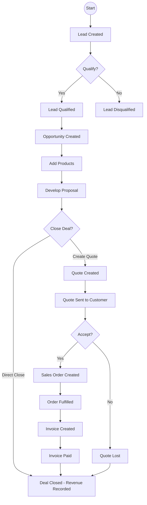

# CRM Sales Module - Data Flow Explanation
## With Diagrams

---

## 1. Introduction

This document explains how data moves through our CRM Sales Module - from the first time we meet a potential customer until we get paid.

---

## 2. The Complete Sales Process

```
┌────────────────────────────────────────────────────────────────────────────┐
│                        LEAD TO CASH PROCESS                                 │
└────────────────────────────────────────────────────────────────────────────┘

      ┌─────────┐     ┌─────────────┐     ┌──────┐     ┌─────────┐
      │   LEAD  │────▶│ OPPORTUNITY │────▶│QUOTE │────▶│  ORDER  │
      └─────────┘     └─────────────┘     └──────┘     └─────────┘
          │                  │                   │              │
          ▼                  ▼                   ▼              ▼
    Qualified          Products             Won          Fulfilled
                        │                  (Accepted)        │
                        ▼                                   ▼
                 EstimatedValue                            ┌──────┐
                                                          │INVOICE│
                                                          └──────┘
                                                              │
                                                              ▼
                                                            ┌────┐
                                                            │PAID│
                                                            └────┘
```

---

## 3. Step-by-Step Data Flow

### Step 1: LEAD CREATION

**What Happens**: A new potential customer enters the system

```
┌─────────────────────────────────────────┐
│           LEAD CREATED                    │
├─────────────────────────────────────────┤
│                                          │
│  Lead Table:                             │
│  ┌────────────────────────────┐          │
│  │ LeadId: [Auto]           │          │
│  │ Subject: "Interested in X"│          │
│  │ FirstName: John          │          │
│  │ LastName: Smith          │          │
│  │ CompanyName: ABC Corp    │          │
│  │ Email: john@abc.com     │          │
│  │ RatingCode: Hot         │          │
│  │ StateCode: 0 (Open)    │          │
│  │ StatusCode: 1 (New)     │          │
│  │ OwnerId: SalesRep1      │          │
│  └────────────────────────────┘          │
│                                          │
└─────────────────────────────────────────┘
```

**Data Captured**:
- Name, Company, Phone, Email
- Lead Source (Campaign, Referral, Website)
- Rating (Hot/Warm/Cold)
- Budget (if known)

**Status**: Open (StateCode = 0)

---

### Step 2: LEAD QUALIFICATION

**What Happens**: Sales rep evaluates if lead is worth pursuing

```
┌──────────────────────────────────────────────────────────┐
│              LEAD QUALIFICATION                            │
├──────────────────────────────────────────────────────────┤
│                                                          │
│  Decision: QUALIFY or DISQUALIFY                         │
│                                                          │
│  ┌──────────────────────────────────────────────────┐    │
│  │ QUALIFY (Good Prospect)                         │    │
│  │                                                  │    │
│  │ 1. Lead.StateCode → 1 (Qualified)              │    │
│  │ 2. Create NEW Opportunity                      │    │
│  │ 3. Link: Opportunity.OriginatingLeadId → Lead │    │
│  │ 4. Link: Opportunity.CustomerId → Account/Contact│    │
│  └──────────────────────────────────────────────────┘    │
│                                                          │
│  ┌──────────────────────────────────────────────────┐    │
│  │ DISQUALIFY (Not Interested)                     │    │
│  │                                                  │    │
│  │ 1. Lead.StateCode → 2 (Disqualified)          │    │
│  │ 2. StatusCode → 7 (Lost), 8, or 9            │    │
│  └──────────────────────────────────────────────────┘    │
│                                                          │
└──────────────────────────────────────────────────────────┘
```

**If Qualified - Creates Opportunity**:
- Copies customer info from Lead
- Creates new Opportunity record
- Links Opportunity back to Lead

---

### Step 3: OPPORTUNITY MANAGEMENT

**What Happens**: We actively work the sales deal

```
┌─────────────────────────────────────────────────────────────┐
│                OPPORTUNITY CREATED                           │
├─────────────────────────────────────────────────────────────┤
│                                                              │
│  Opportunity Table:                                          │
│  ┌────────────────────────────────────────────┐             │
│  │ OpportunityId: [Auto]                      │             │
│  │ Name: "ABC Corp - Enterprise Deal"         │             │
│  │ CustomerId: Account123                    │             │
│  │ EstimatedValue: $50,000                   │             │
│  │ CloseProbability: 30%                     │             │
│  │ EstimatedCloseDate: 2026-03-15            │             │
│  │ SalesStageCode: 1 (New)                   │             │
│  │ StateCode: 0 (Open)                       │             │
│  │ StatusCode: 1 (New)                       │             │
│  │ OwnerId: SalesRep1                        │             │
│  └────────────────────────────────────────────┘             │
│                                                              │
└─────────────────────────────────────────────────────────────┘
```

**Key Activity: Adding Products**

```
┌─────────────────────────────────────────────────────────────┐
│            ADDING PRODUCTS TO OPPORTUNITY                    │
├─────────────────────────────────────────────────────────────┤
│                                                              │
│  OpportunityProduct Table (Line Items):                      │
│  ┌──────────────────────────────────────────────────────┐  │
│  │ OpportunityProductId: 1                              │  │
│  │ OpportunityId: OPP-001  ───┐                        │  │
│  │ ProductId: PROD-001         │ (Foreign Key)         │  │
│  │ Quantity: 10                │                        │  │
│  │ UnitPrice: $1,000          │                        │  │
│  │ ExtendedAmount: $10,000    │ (Qty × Price)         │  │
│  └──────────────────────────────────────────────────────┘  │
│                                                              │
│  ┌──────────────────────────────────────────────────────┐  │
│  │ OpportunityProductId: 2                              │  │
│  │ OpportunityId: OPP-001  ───┐                        │  │
│  │ ProductId: PROD-002         │                        │  │
│  │ Quantity: 5                 │                        │  │
│  │ UnitPrice: $2,000           │                        │  │
│  │ ExtendedAmount: $10,000    │                        │  │
│  └──────────────────────────────────────────────────────┘  │
│                                                              │
│  Total Opportunity Value = $20,000                          │
│                                                              │
└─────────────────────────────────────────────────────────────┘
```

**Status Progression**:
```
┌────────────────────────────────────────────┐
│  Opportunity Status Flow                    │
├────────────────────────────────────────────┤
│                                            │
│   ┌──────────┐                           │
│   │  NEW (1) │◄── Start                 │
│   └────┬─────┘                           │
│        │                                  │
│        ▼                                  │
│   ┌─────────────┐                        │
│   │IN PROGRESS(2)│                       │
│   └────┬────────┘                        │
│        │                                  │
│        ▼         ┌─────────┐              │
│   ┌─────────┐───▶│  WON   │ (4)         │
│   │ ON HOLD │    └─────────┘              │
│   │  (3)   │         │                   │
│   └────┬────┘         │                   │
│        │              │                   │
│        └──────────────┘                   │
│              │                            │
│              ▼                            │
│   ┌─────────────────────┐                │
│   │       LOST (5-7)    │               │
│   └─────────────────────┘                │
│                                            │
└────────────────────────────────────────────┘
```

---

### Step 4: QUOTE CREATION

**What Happens**: We prepare a formal price proposal

```
┌─────────────────────────────────────────────────────────────┐
│                  QUOTE CREATED                               │
├─────────────────────────────────────────────────────────────┤
│                                                              │
│  Quote Table:                                               │
│  ┌────────────────────────────────────────────┐             │
│  │ QuoteId: [Auto]                           │             │
│  │ QuoteNumber: QT-2026-001                  │             │
│  │ Name: "ABC Corp Proposal"                 │             │
│  │ CustomerId: Account123                    │             │
│  │ OpportunityId: OPP-001                    │             │
│  │ TotalAmount: $20,000                     │             │
│  │ DiscountAmount: $2,000                    │             │
│  │ FreightAmount: $500                       │             │
│  │ TotalTax: $1,750                         │             │
│  │ RevisionNumber: 0                        │             │
│  │ EffectiveFrom: 2026-02-01                │             │
│  │ ExpiresOn: 2026-02-28                   │             │
│  │ StateCode: 0 (Open)                      │             │
│  │ StatusCode: 1 (In Progress)              │             │
│  └────────────────────────────────────────────┘             │
│                                                              │
└─────────────────────────────────────────────────────────────┘
```

**Data Copied from Opportunity**:
```
┌─────────────────────────────────────────────────────────────┐
│           DATA COPIED TO QUOTE                              │
├─────────────────────────────────────────────────────────────┤
│                                                              │
│  From Opportunity ──► To Quote:                             │
│  ┌──────────────────┐    ┌──────────────────┐             │
│  │ CustomerId       │───▶│ CustomerId       │             │
│  │ PriceLevelId     │───▶│ PriceLevelId     │             │
│  │ Currency         │───▶│ Currency         │             │
│  │ Products         │───▶│ QuoteDetails     │             │
│  └──────────────────┘    └──────────────────┘             │
│                                                              │
└─────────────────────────────────────────────────────────────┘
```

**Quote Details (Line Items)**:
```
┌─────────────────────────────────────────────────────────────┐
│              QUOTE DETAILS TABLE                            │
├─────────────────────────────────────────────────────────────┤
│  ┌──────────────────────────────────────────────────────┐  │
│  │ QuoteDetailId: 1                                    │  │
│  │ QuoteId: QUOTE-001  ───┐                          │  │
│  │ ProductId: PROD-001     │                          │  │
│  │ Quantity: 10            │                          │  │
│  │ UnitPrice: $1,000      │                          │  │
│  │ ExtendedAmount: $10,000│                          │  │
│  │ LineItemDiscount: 10%   │                          │  │
│  └──────────────────────────────────────────────────────┘  │
│                                                              │
│  ┌──────────────────────────────────────────────────────┐  │
│  │ QuoteDetailId: 2                                    │  │
│  │ QuoteId: QUOTE-001  ───┐                          │  │
│  │ ProductId: PROD-002     │                          │  │
│  │ Quantity: 5             │                          │  │
│  │ UnitPrice: $2,000      │                          │  │
│  │ ExtendedAmount: $10,000│                          │  │
│  └──────────────────────────────────────────────────────┘  │
│                                                              │
└─────────────────────────────────────────────────────────────┘
```

---

### Step 5: QUOTE ACCEPTANCE → SALES ORDER

**What Happens**: Customer accepts the quote

```
┌─────────────────────────────────────────────────────────────┐
│           QUOTE WON - CREATE SALES ORDER                   │
├─────────────────────────────────────────────────────────────┤
│                                                              │
│  Quote Status Changes:                                      │
│  ┌─────────────────────────────────────────────────────┐   │
│  │ Quote.StateCode: 0 → 1 (Won)                      │   │
│  │ Quote.StatusCode: 1 → 3 (Won)                     │   │
│  └─────────────────────────────────────────────────────┘   │
│                                                              │
│  Sales Order Created:                                       │
│  ┌────────────────────────────────────────────┐             │
│  │ SalesOrderId: [Auto]                        │             │
│  │ OrderNumber: SO-2026-001                   │             │
│  │ CustomerId: Account123                      │             │
│  │ QuoteId: QUOTE-001    ◄── Links back       │             │
│  │ OpportunityId: OPP-001                      │             │
│  │ TotalAmount: $20,250                        │             │
│  │ RequestDeliveryBy: 2026-03-15              │             │
│  │ StateCode: 0 (Active)                      │             │
│  │ StatusCode: 1 (New)                        │             │
│  └────────────────────────────────────────────┘             │
│                                                              │
└─────────────────────────────────────────────────────────────┘
```

**Data Copied from Quote to Order**:
```
┌─────────────────────────────────────────────────────────────┐
│           DATA COPIED TO ORDER                             │
├─────────────────────────────────────────────────────────────┤
│                                                              │
│  From Quote ──► To Sales Order:                            │
│  ┌──────────────────┐    ┌──────────────────┐             │
│  │ CustomerId       │───▶│ CustomerId       │             │
│  │ PriceLevelId     │───▶│ PriceLevelId     │             │
│  │ Currency         │───▶│ Currency         │             │
│  │ QuoteDetails    │───▶│ OrderDetails     │             │
│  │ Pricing         │───▶│ Pricing          │             │
│  │ Discounts       │───▶│ Discounts        │             │
│  │ Shipping Address│───▶│ Shipping Address │             │
│  │ Payment Terms   │───▶│ Payment Terms    │             │
│  └──────────────────┘    └──────────────────┘             │
│                                                              │
└─────────────────────────────────────────────────────────────┘
```

**Order Status Progression**:
```
┌────────────────────────────────────────────┐
│  Order Status Flow                          │
├────────────────────────────────────────────┤
│                                            │
│   ┌────────┐     ┌──────────┐             │
│   │  NEW   │────▶│ PENDING  │             │
│   │  (1)   │     │   (2)    │             │
│   └────────┘     └────┬─────┘             │
│                        │                    │
│                        ▼                    │
│                  ┌───────────┐               │
│                  │ SUBMITTED│               │
│                  │   (3)    │               │
│                  └─────┬─────┘               │
│                        │                    │
│                        ▼                    │
│                 ┌────────────┐               │
│                 │FULFILLED  │               │
│                 │   (5)     │               │
│                 └─────┬─────┘               │
│                       │                      │
│                       ▼                      │
│                 ┌───────────┐                │
│                 │ INVOICED │                │
│                 │   (6)    │                │
│                 └─────┬─────┘               │
│                       │                      │
│                       ▼                      │
│                 ┌───────┐                    │
│                 │  PAID │ (7)               │
│                 └───────┘                    │
│                                            │
└────────────────────────────────────────────┘
```

---

### Step 6: INVOICE CREATION

**What Happens**: We create a bill to collect payment

```
┌─────────────────────────────────────────────────────────────┐
│              INVOICE CREATED                                │
├─────────────────────────────────────────────────────────────┤
│                                                              │
│  Invoice Table:                                             │
│  ┌────────────────────────────────────────────┐             │
│  │ InvoiceId: [Auto]                          │             │
│  │ InvoiceNumber: INV-2026-001                 │             │
│  │ CustomerId: Account123                      │             │
│  │ SalesOrderId: ORDER-001  ◄── Links back    │             │
│  │ OpportunityId: OPP-001                      │             │
│  │ TotalAmount: $20,250                       │             │
│  │ DueDate: 2026-04-15                        │             │
│  │ PaymentTermsCode: 4 (Net 30)               │             │
│  │ StateCode: 0 (Active)                      │             │
│  │ StatusCode: 1 (New)                        │             │
│  └────────────────────────────────────────────┘             │
│                                                              │
└─────────────────────────────────────────────────────────────┘
```

**Data Copied from Order to Invoice**:
```
┌─────────────────────────────────────────────────────────────┐
│           DATA COPIED TO INVOICE                           │
├─────────────────────────────────────────────────────────────┤
│                                                              │
│  From Sales Order ──► To Invoice:                          │
│  ┌────────────────────┐    ┌────────────────────┐        │
│  │ CustomerId          │───▶│ CustomerId          │        │
│  │ Pricing            │───▶│ Pricing             │        │
│  │ OrderDetails       │───▶│ InvoiceDetails      │        │
│  │ PaymentTerms       │───▶│ PaymentTerms        │        │
│  │ ShippingAddress    │───▶│ BillingAddress      │        │
│  │ TotalAmount        │───▶│ TotalAmount         │        │
│  └────────────────────┘    └────────────────────┘        │
│                                                              │
└─────────────────────────────────────────────────────────────┘
```

---

### Step 7: PAYMENT & CLOSE

**What Happens**: Customer pays the invoice

```
┌─────────────────────────────────────────────────────────────┐
│           PAYMENT RECEIVED - SALE COMPLETE                  │
├─────────────────────────────────────────────────────────────┤
│                                                              │
│  1. Invoice Updated:                                       │
│     ┌────────────────────────────────────────┐             │
│     │ Invoice.StateCode: 0 → 1 (Paid)        │             │
│     │ Invoice.StatusCode: 1 → 4 (Paid)       │             │
│     │ Invoice.PaidOn: 2026-04-10             │             │
│     └────────────────────────────────────────┘             │
│                                                              │
│  2. Opportunity Updated:                                    │
│     ┌────────────────────────────────────────┐             │
│     │ Opportunity.StateCode: 0 → 1 (Won)      │             │
│     │ Opportunity.StatusCode: 1 → 4 (Won)    │             │
│     │ Opportunity.ActualValue: $20,250        │             │
│     │ Opportunity.ActualCloseDate: 2026-04-10 │             │
│     └────────────────────────────────────────┘             │
│                                                              │
└─────────────────────────────────────────────────────────────┘
```

---

## 4. Data Flow Diagram



---

## 5. Financial Calculation Flow

### How Totals Are Calculated

```
┌────────────────────────────────────────────────────────────────┐
│              FINANCIAL CALCULATION FLOW                         │
├────────────────────────────────────────────────────────────────┤
│                                                                 │
│  Line Item Level:                                             │
│  ┌─────────────────────────────────────────────────────────┐  │
│  │ ExtendedAmount = Quantity × UnitPrice                    │  │
│  │ LineDiscount = ExtendedAmount × Discount%              │  │
│  │ NetLineAmount = ExtendedAmount - LineDiscount           │  │
│  └─────────────────────────────────────────────────────────┘  │
│                                                                 │
│  Order Level:                                                  │
│  ┌─────────────────────────────────────────────────────────┐  │
│  │ TotalLineAmount = Sum of all ExtendedAmounts            │  │
│  │ TotalLineDiscount = Sum of all LineDiscounts           │  │
│  │ Subtotal = TotalLineAmount - TotalLineDiscount         │  │
│  │ OrderDiscount = Subtotal × Discount%                    │  │
│  │ NetSubtotal = Subtotal - OrderDiscount                  │  │
│  │ Tax = NetSubtotal × TaxRate                            │  │
│  │ Freight = FreightAmount                                 │  │
│  │ TOTAL = NetSubtotal + Tax + Freight                    │  │
│  └─────────────────────────────────────────────────────────┘  │
│                                                                 │
└────────────────────────────────────────────────────────────────┘
```

**Example**:
```
Product 1: Qty 10 × $1,000 = $10,000
Product 2: Qty 5  × $2,000 = $10,000
                              ─────────
Total Line Amount:              $20,000
Line Discount (10%):           -$2,000
                              ─────────
Subtotal:                     $18,000
Order Discount (10%):         -$1,700
                              ─────────
Net Subtotal:                 $16,300
Tax (10%):                    +$1,630
Freight:                      +$500
                              ─────────
TOTAL AMOUNT:                 $18,430
```

---

## 6. Complete Data Lineage

### How Data Connects Through the Process

```
┌─────────────────────────────────────────────────────────────────────────────┐
│                    COMPLETE DATA LINEAGE                                     │
├─────────────────────────────────────────────────────────────────────────────┤
│                                                                              │
│  ┌─────────┐    ┌─────────────┐    ┌──────┐    ┌─────────┐               │
│  │   LEAD  │───▶│ OPPORTUNITY │───▶│QUOTE │──▶│  ORDER  │               │
│  └─────────┘    └─────────────┘    └──────┘    └────┬────┘               │
│       │                  │                   │            │                  │
│       │                  │                   │            ▼                  │
│       │                  │                   │       ┌─────────┐             │
│       │                  │                   │       │INVOICE  │             │
│       │                  │                   │       └────┬────┘             │
│       │                  │                   │            │                   │
│       ▼                  ▼                   ▼            ▼                   │
│  ┌─────────────────────────────────────────────────────────────────────┐    │
│  │                    CUSTOMER (Account/Contact)                       │    │
│  └─────────────────────────────────────────────────────────────────────┘    │
│                                                                              │
│  Product Flow:                                                              │
│  ┌─────────────────────────────────────────────────────────────────────┐    │
│  │ Product → OpportunityProduct → QuoteDetail → OrderDetail → InvoiceDetail│  │
│  └─────────────────────────────────────────────────────────────────────┘    │
│                                                                              │
│  Money Flow:                                                                │
│  ┌─────────────────────────────────────────────────────────────────────┐    │
│  │ EstimatedValue → Quote Total → Order Total → Invoice Total → ActualValue│  │
│  └─────────────────────────────────────────────────────────────────────┘    │
│                                                                              │
└─────────────────────────────────────────────────────────────────────────────┘
```

---

## 7. Meeting Summary

> "Our CRM system tracks sales from start to finish. A new potential customer starts as a **Lead**. When we qualify them, we create an **Opportunity** (our active sales deal). We add the products they want to buy.
>
> When we're ready to propose a price, we create a **Quote**. When the customer accepts, it becomes a **Sales Order**. We then send an **Invoice** to get paid.
>
> Everything connects through foreign keys - for example, an Invoice knows which Order it came from, which came from a Quote, which came from an Opportunity, which is for a specific Customer.
>
> Every stage tracks its own status, and once the invoice is paid, the opportunity is marked as won and revenue is recorded."

---

**End of Document**
