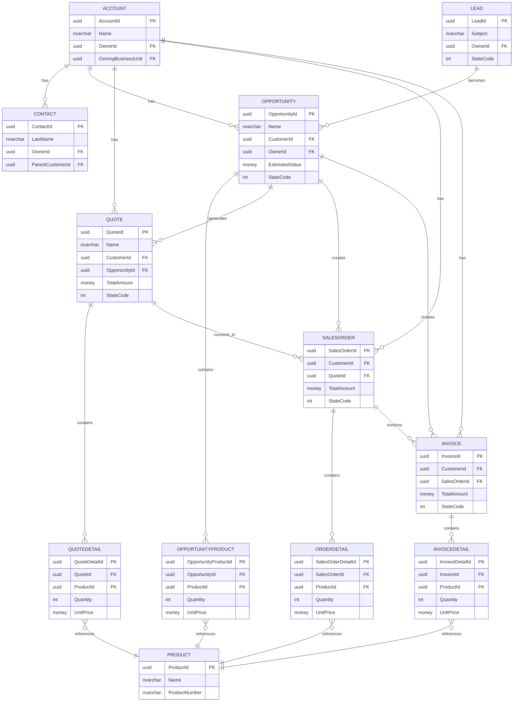

# CRM Sales Module - Data Structure Explanation
## With Diagrams

---

## 1. Introduction

This document explains the **Data Structure** of our CRM Sales Module database. It shows what tables exist and how they connect to each other.

---

## 2. Core Entities Overview

The CRM has 7 main tables that handle the sales process:

```
┌─────────────────────────────────────────────────────────────────┐
│                    CORE ENTITIES                                  │
├─────────────────────────────────────────────────────────────────┤
│                                                                  │
│   ACCOUNT ──────► CONTACT                                       │
│       │               │                                          │
│       │               ▼                                          │
│       │         OPPORTUNITY ◄──── LEAD                          │
│       │              │                                           │
│       │              ▼                                           │
│       │            QUOTE                                         │
│       │              │                                           │
│       │              ▼                                           │
│       │         SALES ORDER                                      │
│       │              │                                           │
│       │              ▼                                           │
│       └────────► INVOICE                                         │
│                                                                  │
└─────────────────────────────────────────────────────────────────┘
```

---

## 3. Each Entity Explained

### 3.1 ACCOUNT (Company Table)

**Purpose**: Stores information about companies we sell to

**Table Name**: AccountBase

**Primary Key**:
```
AccountId (UniqueIdentifier)
```

**Required Fields**:
- Name (Company name)

**Important Fields**:
| Field | Type | Description |
|-------|------|-------------|
| AccountNumber | Text | Our internal ID |
| IndustryCode | Number | Industry type |
| Revenue | Money | Annual revenue |
| NumberOfEmployees | Number | Company size |
| CreditLimit | Money | Credit we extend |
| Telephone1 | Text | Phone number |
| EmailAddress1 | Text | Email address |
| WebsiteUrl | Text | Website |

**Foreign Keys**:
| Field | Links To | Meaning |
|-------|----------|---------|
| OwnerId | SystemUser | Who owns this account |
| OwningBusinessUnit | BusinessUnit | Department |
| ParentAccountId | Account | Parent company |
| PrimaryContactId | Contact | Main contact |
| PriceLevelId | PriceList | Default pricing |
| TransactionCurrencyId | Currency | Currency used |

**Status**: 
- StateCode: 0 = Active, 1 = Inactive

**Links To**:
- Many Contacts
- Many Opportunities
- Many Quotes
- Many SalesOrders
- Many Invoices

---

### 3.2 CONTACT (Person Table)

**Purpose**: Stores information about individuals at companies

**Table Name**: ContactBase

**Primary Key**:
```
ContactId (UniqueIdentifier)
```

**Required Fields**:
- LastName

**Important Fields**:
| Field | Type | Description |
|-------|------|-------------|
| FirstName | Text | First name |
| FullName | Text | First + Last |
| EmailAddress1 | Text | Email |
| Telephone1 | Text | Phone |
| MobilePhone | Text | Mobile |
| JobTitle | Text | Position |

**Foreign Keys**:
| Field | Links To | Meaning |
|-------|----------|---------|
| OwnerId | SystemUser | Who owns |
| OwningBusinessUnit | BusinessUnit | Department |
| ParentCustomerId | Account/Contact | Works at which company |

**Links To**:
- Many Opportunities
- Many Quotes
- Many Orders
- Many Invoices

---

### 3.3 LEAD (Potential Customer)

**Purpose**: A potential customer who has shown interest but not yet qualified

**Table Name**: LeadBase

**Primary Key**:
```
LeadId (UniqueIdentifier)
```

**Required Fields**:
- Subject (What the lead is about)

**Important Fields**:
| Field | Type | Description |
|-------|------|-------------|
| FirstName | Text | First name |
| LastName | Text | Last name |
| CompanyName | Text | Company |
| EmailAddress | Text | Email |
| Telephone | Text | Phone |
| IndustryCode | Number | Industry |
| LeadSourceCode | Number | Where did they come from? |
| RatingCode | Number | Hot/Warm/Cold |
| BudgetAmount | Money | Their budget |
| EstimatedAmount | Money | Our estimated value |

**Foreign Keys**:
| Field | Links To | Meaning |
|-------|----------|---------|
| OwnerId | SystemUser | Who works this lead |
| OwningBusinessUnit | BusinessUnit | Department |
| CampaignId | Campaign | Source campaign |
| ParentAccountId | Account | Associated company |
| ParentContactId | Contact | Associated person |
| QualifyingOpportunityId | Opportunity | Created opportunity |

**Status Tracking**:
| StateCode | StatusCode | Meaning |
|-----------|------------|---------|
| 0 (Open) | 1-4 | New, Attempted Contact, Contacted, Open |
| 1 (Qualified) | 5 | Ready for opportunity |
| 2 (Disqualified) | 7-9 | Lost, Cannot Contact, Not Interested |

**Can Become**:
- Account (when converted)
- Contact (when converted)
- Opportunity (when qualified)

---

### 3.4 OPPORTUNITY (Active Sale)

**Purpose**: A qualified sales deal we are actively working on

**Table Name**: OpportunityBase

**Primary Key**:
```
OpportunityId (UniqueIdentifier)
```

**Required Fields**:
- Name
- CustomerId (Account or Contact)

**Important Fields**:
| Field | Type | Description |
|-------|------|-------------|
| EstimatedValue | Money | Expected revenue |
| ActualValue | Money | Actual when closed |
| CloseProbability | Number | Chance of winning (%) |
| EstimatedCloseDate | Date | Expected close |
| ActualCloseDate | Date | Actual close |
| SalesStageCode | Number | Which stage |

**Foreign Keys**:
| Field | Links To | Meaning |
|-------|----------|---------|
| OwnerId | SystemUser | Sales rep |
| CustomerId | Account/Contact | Who we're selling to |
| CustomerIdType | Number | 1=Account, 2=Contact |
| PriceLevelId | PriceList | Pricing to use |
| TransactionCurrencyId | Currency | Currency |
| OriginatingLeadId | Lead | If came from lead |

**Financial Fields (Auto-Calculated)**:
- TotalAmount
- TotalLineItemAmount
- TotalDiscountAmount
- FreightAmount
- TotalTax

**Status Tracking**:
| StateCode | StatusCode | Meaning |
|-----------|------------|---------|
| 0 (Open) | 1-3 | New, In Progress, On Hold |
| 1 (Won) | 4 | We won! |
| 2 (Lost) | 5-7 | Lost, Cancelled, Out-Sold |

**Links To**:
- Many OpportunityProducts (line items)
- Many Quotes
- One SalesOrder
- One Invoice

---

### 3.5 QUOTE (Price Proposal)

**Purpose**: A formal price proposal sent to the customer

**Table Name**: QuoteBase

**Primary Key**:
```
QuoteId (UniqueIdentifier)
```

**Required Fields**:
- Name
- CustomerId

**Important Fields**:
| Field | Type | Description |
|-------|------|-------------|
| QuoteNumber | Text | Auto-generated number |
| RevisionNumber | Number | Version number |
| TotalAmount | Money | Total value |
| DiscountAmount | Money | Discount |
| DiscountPercentage | Percent | Discount % |
| FreightAmount | Money | Shipping |
| TotalTax | Money | Tax |
| EffectiveFrom | Date | Start date |
| EffectiveTo | Date | End date |
| ExpiresOn | Date | Expiration |

**Foreign Keys**:
| Field | Links To | Meaning |
|-------|----------|---------|
| OwnerId | SystemUser | Owner |
| CustomerId | Account/Contact | Customer |
| PriceLevelId | PriceList | Pricing |
| TransactionCurrencyId | Currency | Currency |
| OpportunityId | Opportunity | Source opportunity |

**Status Tracking**:
| StateCode | StatusCode | Meaning |
|-----------|------------|---------|
| 0 (Open) | 1-2 | In Progress |
| 1 (Won) | 3-5 | Won, Accepted, Revised |
| 2 (Lost) | 6-8 | Lost, Declined, Cancelled |

**Links To**:
- Many QuoteDetails (line items)
- One SalesOrder (when accepted)

---

### 3.6 SALES ORDER (Confirmed Order)

**Purpose**: A confirmed purchase order from customer

**Table Name**: SalesOrderBase

**Primary Key**:
```
SalesOrderId (UniqueIdentifier)
```

**Required Fields**:
- CustomerId

**Important Fields**:
| Field | Type | Description |
|-------|------|-------------|
| OrderNumber | Text | Auto-generated |
| TotalAmount | Money | Total value |
| DiscountAmount | Money | Discount |
| FreightAmount | Money | Shipping |
| TotalTax | Money | Tax |
| RequestDeliveryBy | Date | Requested delivery |
| SubmitStatus | Number | ERP status |

**Foreign Keys**:
| Field | Links To | Meaning |
|-------|----------|---------|
| OwnerId | SystemUser | Owner |
| CustomerId | Account/Contact | Customer |
| PriceLevelId | PriceList | Pricing |
| TransactionCurrencyId | Currency | Currency |
| OpportunityId | Opportunity | Source |
| QuoteId | Quote | Source quote |

**Status Tracking**:
| StateCode | StatusCode | Meaning |
|-----------|------------|---------|
| 0 (Active) | 1-4 | New, Pending, Submitted, Cancelled |
| 1 (Fulfilled) | 5 | Fulfilled |
| 2 (Invoiced) | 6 | Invoiced |
| 3 (Paid) | 7 | Paid |
| 4 (Cancelled) | 8 | Cancelled |

**Links To**:
- Many OrderDetails (line items)
- One Invoice

---

### 3.7 INVOICE (Bill)

**Purpose**: A bill sent to customer requesting payment

**Table Name**: InvoiceBase

**Primary Key**:
```
InvoiceId (UniqueIdentifier)
```

**Required Fields**:
- CustomerId

**Important Fields**:
| Field | Type | Description |
|-------|------|-------------|
| InvoiceNumber | Text | Auto-generated |
| TotalAmount | Money | Amount due |
| DiscountAmount | Money | Discount |
| FreightAmount | Money | Shipping |
| TotalTax | Money | Tax |
| DueDate | Date | Payment due date |
| PaymentTermsCode | Number | Terms (Net 30, etc.) |
| DateSent | Date | When sent |
| PaidOn | Date | When paid |

**Foreign Keys**:
| Field | Links To | Meaning |
|-------|----------|---------|
| OwnerId | SystemUser | Owner |
| CustomerId | Account/Contact | Customer |
| PriceLevelId | PriceList | Pricing |
| TransactionCurrencyId | Currency | Currency |
| SalesOrderId | SalesOrder | Source order |
| OpportunityId | Opportunity | Original opportunity |

**Status Tracking**:
| StateCode | StatusCode | Meaning |
|-----------|------------|---------|
| 0 (Active) | 1-3 | New, Partial, Complete |
| 1 (Paid) | 4-5 | Paid, Partial |
| 2 (Cancelled) | 6 | Cancelled |

**Links To**:
- Many InvoiceDetails (line items)

---

## 4. Supporting Entities

### 4.1 PRODUCT

**Purpose**: Products and services we sell

**Primary Key**: ProductId

**Important Fields**:
| Field | Type | Description |
|-------|------|-------------|
| Name | Text | Product name |
| ProductNumber | Text | SKU/Part number |
| ProductTypeCode | Number | Product or Service |
| Price | Money | Default price |
| Cost | Money | Our cost |
| QuantityOnHand | Number | Inventory |

**Used In**:
- OpportunityProducts
- QuoteDetails
- OrderDetails
- InvoiceDetails

---

### 4.2 PRICELIST (PriceLevel)

**Purpose**: Pricing rules for products

**Primary Key**: PriceLevelId

**Important Fields**:
| Field | Type | Description |
|-------|------|-------------|
| Name | Text | Price list name |
| BeginDate | Date | Start date |
| EndDate | Date | End date |
| IsDefault | Yes/No | Default list |
| TransactionCurrencyId | Currency | Currency |

---

### 4.3 TRANSACTIONCURRENCY

**Purpose**: Support for multiple currencies

**Primary Key**: TransactionCurrencyId

**Important Fields**:
| Field | Type | Description |
|-------|------|-------------|
| ISOCurrencyCode | Text | USD, EUR, GBP |
| CurrencySymbol | Text | $, €, £ |
| CurrencyName | Text | Full name |
| Precision | Number | Decimal places |

---

## 5. Line Item Tables (Detail Tables)

These tables store individual products in each transaction:

### 5.1 OPPORTUNITYPRODUCT
```
OpportunityId (FK) ──→ Opportunity
ProductId (FK) ──────→ Product
Quantity
UnitPrice
ExtendedAmount (Qty × Price)
LineItemDiscount
Tax
```

### 5.2 QUOTEDETAIL
```
QuoteId (FK) ────────→ Quote
ProductId (FK) ──────→ Product
Quantity
UnitPrice
ExtendedAmount
LineItemDiscount
Tax
```

### 5.3 ORDERDETAIL
```
SalesOrderId (FK) ──→ SalesOrder
ProductId (FK) ──────→ Product
Quantity
UnitPrice
ExtendedAmount
LineItemDiscount
Tax
```

### 5.4 INVOICEDETAIL
```
InvoiceId (FK) ──────→ Invoice
ProductId (FK) ──────→ Product
Quantity
UnitPrice
ExtendedAmount
LineItemDiscount
Tax
```

---

## 6. Security Entities

### 6.1 SYSTEMUSER
- **Purpose**: People who use the system
- **Primary Key**: SystemUserId
- **Key Fields**: FullName, DomainName, BusinessUnitId

### 6.2 ROLE
- **Purpose**: Permissions (what users can do)
- **Primary Key**: RoleId
- **Key Fields**: Name, BusinessUnitId

### 6.3 BUSINESSUNIT
- **Purpose**: Departments/teams
- **Primary Key**: BusinessUnitId
- **Key Fields**: Name, ParentBusinessUnitId

---

## 7. Entity Relationship Diagram



---

## 8. Summary

**Core Tables**: Account, Contact, Lead, Opportunity, Quote, SalesOrder, Invoice

**Supporting Tables**: Product, PriceList, Currency

**Line Item Tables**: OpportunityProduct, QuoteDetail, OrderDetail, InvoiceDetail

**Security Tables**: SystemUser, Role, BusinessUnit

**Key Concept**: Every table has a Primary Key (unique ID), and tables connect through Foreign Keys that link records together.

---

**End of Document**
