# Microsoft Dynamics 365 CRM - Complete Mermaid Diagrams

## Database Schema Overview

**Database:** Microsoft Dynamics 365 CRM (On-Premise)  
**Total Tables:** 300+  
**Primary Key Pattern:** uniqueidentifier (GUID)  
**Ownership Pattern:** OwnerId + OwnerIdType (8=User, 9=Team)

---

## 1. COMPLETE ER DIAGRAM - CORE TABLES

```mermaid
erDiagram
    %% ==================== ORGANIZATION HIERARCHY ====================
    ORGANIZATION_BASE ||--o{ BUSINESS_UNIT_BASE : OrganizationId
    ORGANIZATION_BASE ||--o{ TRANSACTION_CURRENCY_BASE : Currency
    ORGANIZATION_BASE ||--o{ CALENDAR_BASE : DefaultCalendar
    
    BUSINESS_UNIT_BASE ||--o{ BUSINESS_UNIT_BASE : ParentBusinessUnitId
    BUSINESS_UNIT_BASE ||--o{ SYSTEM_USER_BASE : BusinessUnitId
    BUSINESS_UNIT_BASE ||--o{ TEAM_BASE : BusinessUnitId
    BUSINESS_UNIT_BASE ||--o{ ACCOUNT_BASE : OwningBusinessUnit
    BUSINESS_UNIT_BASE ||--o{ CONTACT_BASE : OwningBusinessUnit

    %% ==================== USER SECURITY ====================
    SYSTEM_USER_BASE ||--o{ TEAM_MEMBERSHIP : SystemUserId
    SYSTEM_USER_BASE ||--o{ SYSTEM_USER_ROLES : SystemUserId
    SYSTEM_USER_BASE ||--o{ SYSTEM_USER_MANAGER_MAP : SystemUserId
    SYSTEM_USER_BASE ||--o{ USER_SETTINGS_BASE : SystemUserId
    SYSTEM_USER_BASE ||--|{ OWNER_BASE : OwnerId
    
    TEAM_BASE ||--o{ TEAM_MEMBERSHIP : TeamId
    TEAM_BASE ||--o{ TEAM_ROLES : TeamId
    TEAM_BASE ||--|{ OWNER_BASE : OwnerId
    
    ROLE_BASE ||--o{ ROLE_PRIVILEGES_BASE : RoleId
    ROLE_BASE ||--o{ SYSTEM_USER_ROLES : RoleId
    ROLE_BASE ||--o{ TEAM_ROLES : RoleId
    
    PRIVILEGE_BASE ||--o{ ROLE_PRIVILEGES_BASE : PrivilegeId

    %% ==================== CUSTOMER ENTITIES ====================
    ACCOUNT_BASE ||--o{ CONTACT_BASE : ParentContactId
    ACCOUNT_BASE ||--o{ ACCOUNT_BASE : ParentAccountId
    ACCOUNT_BASE ||--o{ CUSTOMER_ADDRESS_BASE : ParentId
    
    CONTACT_BASE ||--o{ CONTACT_BASE : ParentContactId
    
    LEAD_BASE ||--o{ ACCOUNT_BASE : ParentAccountId
    LEAD_BASE ||--o{ CONTACT_BASE : ParentContactId
    LEAD_BASE ||--o{ LEAD_ADDRESS_BASE : ParentId
    LEAD_BASE ||--o{ OPPORTUNITY_BASE : OriginatingLeadId

    %% ==================== OPPORTUNITY PIPELINE ====================
    OPPORTUNITY_BASE ||--o{ QUOTE_BASE : OpportunityId
    OPPORTUNITY_BASE ||--o{ OPPORTUNITY_PRODUCT_BASE : OpportunityId
    OPPORTUNITY_BASE ||--o{ OPPORTUNITY_COMPETITORS : OpportunityId
    
    QUOTE_BASE ||--o{ QUOTE_DETAIL_BASE : QuoteId
    QUOTE_BASE ||--o{ SALES_ORDER_BASE : QuoteId
    
    SALES_ORDER_BASE ||--o{ SALES_ORDER_DETAIL_BASE : SalesOrderId
    SALES_ORDER_BASE ||--o{ INVOICE_BASE : SalesOrderId
    
    INVOICE_BASE ||--o{ INVOICE_DETAIL_BASE : InvoiceId

    %% ==================== PRODUCTS & PRICING ====================
    PRODUCT_BASE ||--o{ PRODUCT_PRICE_LEVEL_BASE : ProductId
    PRODUCT_BASE ||--o{ OPPORTUNITY_PRODUCT_BASE : ProductId
    PRODUCT_BASE ||--o{ QUOTE_DETAIL_BASE : ProductId
    PRODUCT_BASE ||--o{ SALES_ORDER_DETAIL_BASE : ProductId
    PRODUCT_BASE ||--o{ INVOICE_DETAIL_BASE : ProductId
    
    PRICE_LEVEL_BASE ||--o{ PRODUCT_PRICE_LEVEL_BASE : PriceLevelId
    
    UOM_SCHEDULE_BASE ||--o{ UOM_BASE : UoMScheduleId
    
    DISCOUNT_TYPE_BASE ||--o{ DISCOUNT_BASE : DiscountTypeId

    %% ==================== ACTIVITIES ====================
    ACTIVITY_POINTER_BASE ||--o{ ACTIVITY_PARTY_BASE : ActivityId
    ACTIVITY_POINTER_BASE ||--|{ EMAIL_BASE : ActivityId
    ACTIVITY_POINTER_BASE ||--|{ PHONE_CALL_BASE : ActivityId
    ACTIVITY_POINTER_BASE ||--|{ TASK_BASE : ActivityId
    ACTIVITY_POINTER_BASE ||--|{ APPOINTMENT_BASE : ActivityId
    ACTIVITY_POINTER_BASE ||--|{ LETTER_BASE : ActivityId
    ACTIVITY_POINTER_BASE ||--|{ FAX_BASE : ActivityId
    ACTIVITY_POINTER_BASE ||--|{ SERVICE_APPOINTMENT_BASE : ActivityId
    
    ACCOUNT_BASE ||--o{ ACTIVITY_POINTER_BASE : RegardingObjectId
    CONTACT_BASE ||--o{ ACTIVITY_POINTER_BASE : RegardingObjectId
    LEAD_BASE ||--o{ ACTIVITY_POINTER_BASE : RegardingObjectId
    OPPORTUNITY_BASE ||--o{ ACTIVITY_POINTER_BASE : RegardingObjectId
    
    ACCOUNT_BASE ||--o{ ACTIVITY_PARTY_BASE : PartyId
    CONTACT_BASE ||--o{ ACTIVITY_PARTY_BASE : PartyId
    LEAD_BASE ||--o{ ACTIVITY_PARTY_BASE : PartyId
    OPPORTUNITY_BASE ||--o{ ACTIVITY_PARTY_BASE : PartyId

    %% ==================== CONNECTION RELATIONSHIPS ====================
    CONNECTION_ROLE_BASE ||--o{ CONNECTION_BASE : Record1RoleId
    CONNECTION_ROLE_BASE ||--o{ CONNECTION_BASE : Record2RoleId
    
    ACCOUNT_BASE ||--o{ CONNECTION_BASE : Record1Id
    ACCOUNT_BASE ||--o{ CONNECTION_BASE : Record2Id
    CONTACT_BASE ||--o{ CONNECTION_BASE : Record1Id
    CONTACT_BASE ||--o{ CONNECTION_BASE : Record2Id

    %% ==================== RECORD SHARING ====================
    PRINCIPAL_OBJECT_ACCESS ||--o{ SYSTEM_USER_BASE : PrincipalId
    PRINCIPAL_OBJECT_ACCESS ||--o{ TEAM_BASE : PrincipalId
    PRINCIPAL_OBJECT_ACCESS ||--o{ ACCOUNT_BASE : ObjectId
    PRINCIPAL_OBJECT_ACCESS ||--o{ CONTACT_BASE : ObjectId
    PRINCIPAL_OBJECT_ACCESS ||--o{ LEAD_BASE : ObjectId
    PRINCIPAL_OBJECT_ACCESS ||--o{ OPPORTUNITY_BASE : ObjectId

    %% ==================== AUDIT ====================
    SYSTEM_USER_BASE ||--o{ AUDIT_BASE : UserId
    ACCOUNT_BASE ||--o{ AUDIT_BASE : ObjectId
    CONTACT_BASE ||--o{ AUDIT_BASE : ObjectId
    LEAD_BASE ||--o{ AUDIT_BASE : ObjectId
    OPPORTUNITY_BASE ||--o{ AUDIT_BASE : ObjectId

    %% ==================== QUEUES ====================
    QUEUE_BASE ||--o{ QUEUE_ITEM_BASE : QueueId
    QUEUE_BASE ||--o{ QUEUE_MEMBERSHIP : QueueId
    SYSTEM_USER_BASE ||--o{ QUEUE_MEMBERSHIP : SystemUserId
    
    QUEUE_ITEM_BASE ||--o{ ACCOUNT_BASE : ObjectId
    QUEUE_ITEM_BASE ||--o{ CONTACT_BASE : ObjectId
    QUEUE_ITEM_BASE ||--o{ LEAD_BASE : ObjectId
    QUEUE_ITEM_BASE ||--o{ OPPORTUNITY_BASE : ObjectId
    QUEUE_ITEM_BASE ||--o{ ACTIVITY_POINTER_BASE : ObjectId

    %% ==================== TERRITORY ====================
    TERRITORY_BASE ||--o{ ACCOUNT_BASE : TerritoryId
    TERRITORY_BASE ||--o{ SYSTEM_USER_BASE : TerritoryId

    %% ==================== CONTRACTS & ENTITLEMENTS ====================
    CONTRACT_TEMPLATE_BASE ||--o{ CONTRACT_BASE : ContractTemplateId
    CONTRACT_BASE ||--o{ CONTRACT_DETAIL_BASE : ContractId
    
    ENTITLEMENT_TEMPLATE_BASE ||--o{ ENTITLEMENT_BASE : EntitlementTemplateId
    
    INCIDENT_BASE ||--o{ CONTRACT_BASE : ContractId

    %% ==================== MARKETING ====================
    CAMPAIGN_BASE ||--o{ CAMPAIGN_ITEM_BASE : CampaignId
    CAMPAIGN_BASE ||--o{ CAMPAIGN_RESPONSE_BASE : CampaignId
    CAMPAIGN_BASE ||--o{ LIST_BASE : CampaignId
    
    LIST_BASE ||--o{ LIST_MEMBER_BASE : ListId
    ACCOUNT_BASE ||--o{ LIST_MEMBER_BASE : EntityId
    CONTACT_BASE ||--o{ LIST_MEMBER_BASE : EntityId
    LEAD_BASE ||--o{ LIST_MEMBER_BASE : EntityId
```

---

## 2. LEAD MANAGEMENT - STATE MACHINE

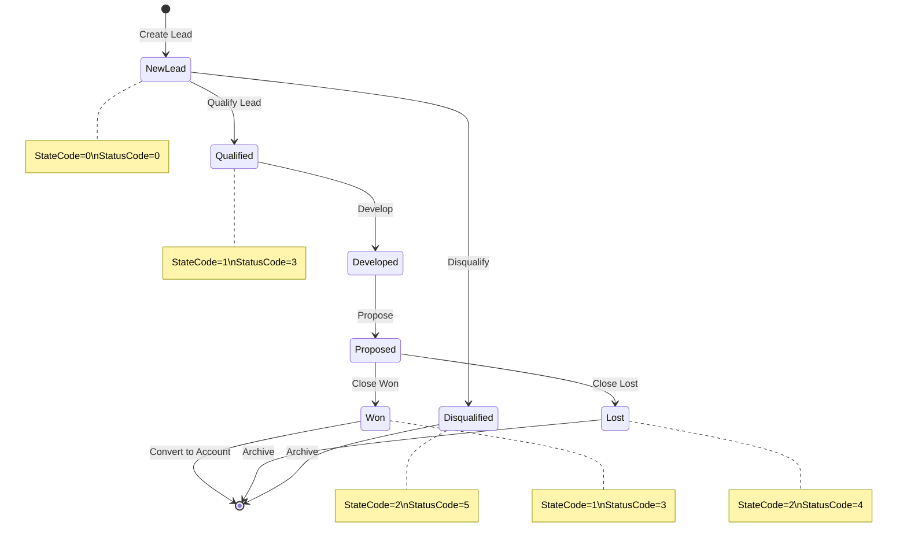

---

## 3. OPPORTUNITY PIPELINE - STATE MACHINE

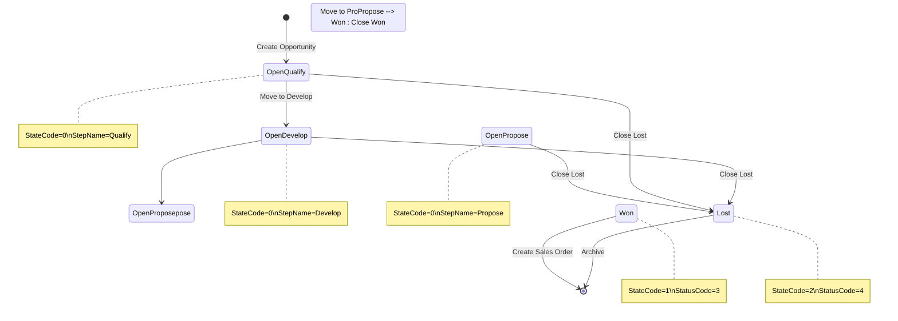

---

## 4. SALES PROCESS FLOW

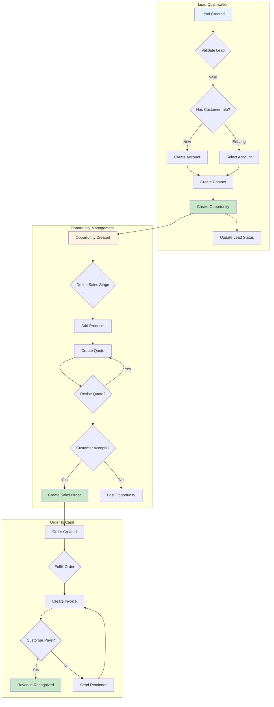

---

## 5. SECURITY & ACCESS CONTROL FLOW

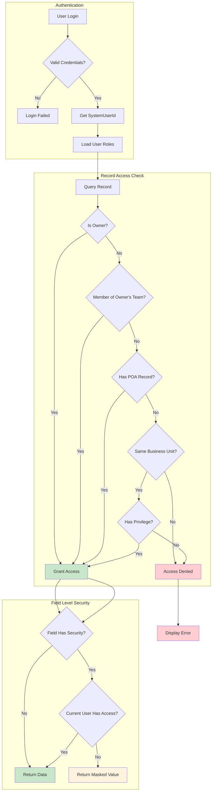

---

## 6. RECORD SHARING WORKFLOW

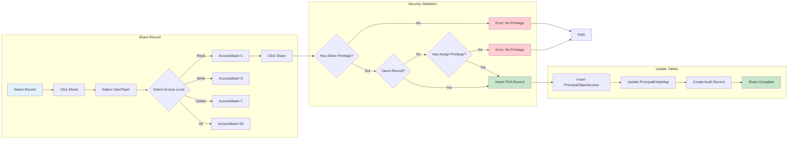

---

## 7. ACTIVITY MANAGEMENT FLOW

```mermaid
flowchart TB
    subgraph CREATE_ACTIVITY ["Create Activity"]
        AM1[Select Activity Type] --> AM2{Fill Required Fields}
        AM2 --> AM3[Set Owner]
        AM3 --> AM4{Add Regarding?}
        AM4 -->|Yes| AM5[Select Regarding Record]
        AM4 -->|No| AM6[Skip Regarding]
        AM5 --> AM7[Add Participants]
    end
    
    subgraph PARTICIPANTS ["Activity Parties"]
        AM6 --> AM7
        AM7 --> AM8{Create ActivityParty Records}
        AM8 --> AM9[Add Owner as Party]
        AM9 --> AM10{Regarding Party?}
        AM10 -->|Yes| AM11[Add Regarding Party]
        AM10 -->|No| AM12[Add To/Cc Parties]
        AM11 --> AM12
    end
    
    subgraph SAVE ["Save & Complete"]
        AM12 --> SAVE1[Insert ActivityPointerBase]
        SAVE1 --> SAVE2[Insert ActivityPartyBase]
        SAVE2 --> SAVE3[Update PrincipalEntityMap]
        SAVE3 --> SAVE4[Create Audit Record]
        SAVE4 --> COMPLETE[Activity Created]
    end
    
    note right of AM1: TypeCodes:\n4201=Appointment\n4202=Email\n4210=PhoneCall\n4212=Task
    
    style AM1 fill:#e3f2fd
    style SAVE1 fill:#c8e6c9
    style COMPLETE fill:#c8e6c9
```

---

## 8. DATA MODEL - OWNERSHIP

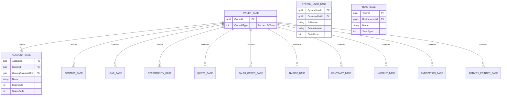

---

## 9. CUSTOMER RELATIONSHIP MODEL

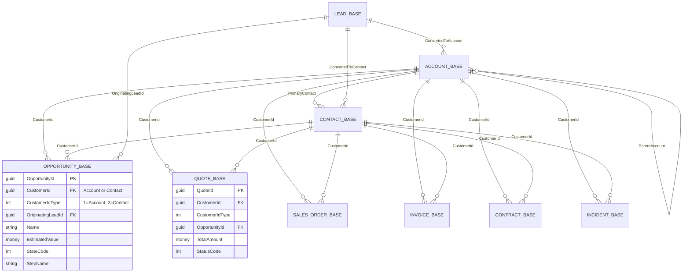

---

## 10. AUDIT TRACKING FLOW

```mermaid
flowchart TD
    subgraph TRIGGER ["Audit Trigger"]
        AT1[User Modifies Record] --> AT2[Platform Intercepts]
        AT2 --> AT3[Capture Old Values]
        AT3 --> AT4[Perform UPDATE]
    end
    
    subgraph CREATE_AUDIT ["Create Audit"]
        AT4 --> A1[Determine Changed Fields]
        A1 --> A2[Generate AttributeMask]
        A2 --> A3[Get User Context]
        A3 --> A4[Insert AuditBase Record]
    end
    
    subgraph STORE_DETAILS ["Store Details"]
        A4 --> D1{Detailed Tracking Enabled?}
        D1 -->|Yes| D2[Insert AuditDetail Values]
        D1 -->|No| D3[Skip Details]
        D2 --> COMPLETE
        D3 --> COMPLETE
    end
    
    COMPLETE[Complete]
    
    note right of AT1: Operation Types:\n1=Create\n2=Update\n3=Delete
    
    style AT1 fill:#e3f2fd
    style A4 fill:#c8e6c9
    style COMPLETE fill:#c8e6c9
```

---

## 11. SEQUENCE: LEAD QUALIFICATION

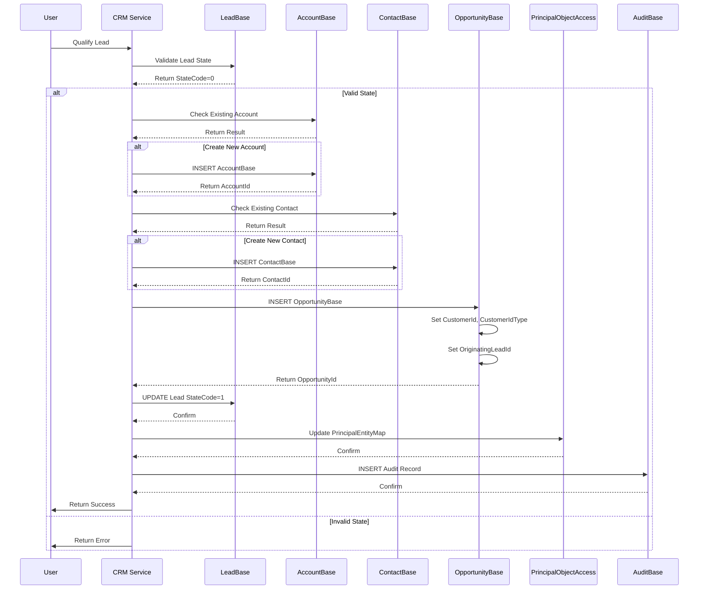

---

## 12. SEQUENCE: OPPORTUNITY CLOSE (WON)

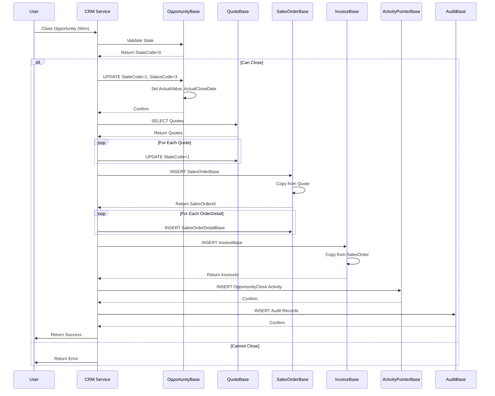

---

## 13. SYSTEM USER & TEAM RELATIONSHIPS

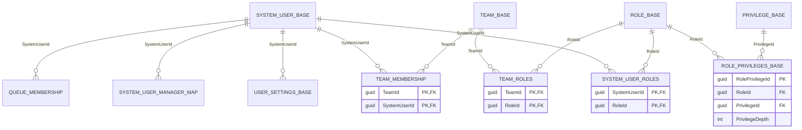

---

## 14. INHERITED SECURITY MODEL

```mermaid
flowchart LR
    subgraph PRIVILEGES ["Privilege Definition"]
        P1[PrivilegeBase] --> P2[Read]
        P1 --> P3[Write]
        P1 --> P4[Delete]
        P1 --> P5[Append]
        P1 --> P6[AppendTo]
        P1 --> P7[Share]
        P1 --> P8[Assign]
    end
    
    subgraph ROLE_ASSIGNMENT ["Role Assignment"]
        P2 --> R1[RolePrivileges]
        P3 --> R1
        P4 --> R1
        P5 --> R1
        P6 --> R1
        P7 --> R1
        P8 --> R1
        
        R1 --> R2[SystemUserRoles]
        R1 --> R3[TeamRoles]
    end
    
    subgraph USER_CONTEXT ["User Context"]
        R2 --> U1[SystemUserBase]
        R3 --> T1[TeamBase]
        T1 --> TM[TeamMembership]
        TM --> U1
    end
    
    subgraph RECORD_ACCESS ["Record Access"]
        U1 --> RA1[Owner Check]
        RA1 --> RA2[POA Check]
        RA2 --> RA3[BU Check]
    end
    
    note right of P1: PrivilegeId uniqueidentifier\nName string\nAccessRight integer
```

---

*All diagrams are compatible with https://mermaid.live*  
*Generated for Microsoft Dynamics 365 CRM Database*
