# Microsoft Dynamics 365 CRM Sales Module
## Enterprise Mermaid Diagrams - Data Structure & Data Flow

---

## SECTION 1 – Entity Relationship Diagram (ERD)

### 1.1 Core Sales Entities ERD

```mermaid
erDiagram
    %% ==================== CORE SALES ENTITIES ====================
    
    ACCOUNT {
        uuid AccountId PK
        nvarchar AccountNumber
        nvarchar Name
        uuid OwningBusinessUnit FK
        uuid OwnerId FK
        int StateCode
        int StatusCode
        uuid ParentAccountId FK
        uuid PrimaryContactId FK
        uuid MasterId FK
        int IndustryCode
        money Revenue
        int NumberOfEmployees
        timestamp VersionNumber
    }
    
    CONTACT {
        uuid ContactId PK
        nvarchar FirstName
        nvarchar LastName
        nvarchar FullName
        nvarchar EmailAddress1
        nvarchar Telephone1
        uuid OwningBusinessUnit FK
        uuid OwnerId FK
        uuid ParentCustomerId FK
        int ParentCustomerIdType
        uuid MasterId FK
        int StateCode
        int StatusCode
        timestamp VersionNumber
    }
    
    LEAD {
        uuid LeadId PK
        nvarchar Subject
        nvarchar FirstName
        nvarchar LastName
        nvarchar CompanyName
        nvarchar EmailAddress
        nvarchar Telephone
        uuid OwningBusinessUnit FK
        uuid OwnerId FK
        int StateCode
        int StatusCode
        uuid CampaignId FK
        uuid QualifyingOpportunityId FK
        uuid ParentAccountId FK
        uuid ParentContactId FK
        uuid OriginatingLeadId FK
        int IndustryCode
        int LeadSourceCode
        nvarchar TraversedPath
        timestamp VersionNumber
    }
    
    OPPORTUNITY {
        uuid OpportunityId PK
        nvarchar Name
        uuid OwningBusinessUnit FK
        uuid OwnerId FK
        int StateCode
        int StatusCode
        uuid CustomerId
        int CustomerIdType
        uuid PriceLevelId FK
        uuid TransactionCurrencyId FK
        money EstimatedValue
        money EstimatedValue_Base
        money ActualValue
        money TotalAmount
        int CloseProbability
        datetime EstimatedCloseDate
        datetime ActualCloseDate
        int SalesStageCode
        nvarchar SalesStage
        uuid OriginatingLeadId FK
        uuid CampaignId FK
        nvarchar TraversedPath
        timestamp VersionNumber
    }
    
    QUOTE {
        uuid QuoteId PK
        nvarchar QuoteNumber
        int RevisionNumber
        nvarchar Name
        uuid OwningBusinessUnit FK
        uuid OwnerId FK
        int StateCode
        int StatusCode
        uuid CustomerId
        int CustomerIdType
        uuid PriceLevelId FK
        uuid TransactionCurrencyId FK
        uuid OpportunityId FK
        money TotalAmount
        money DiscountAmount
        money FreightAmount
        money TotalTax
        datetime EffectiveFrom
        datetime EffectiveTo
        datetime ExpiresOn
        timestamp VersionNumber
    }
    
    SALESORDER {
        uuid SalesOrderId PK
        nvarchar OrderNumber
        uuid OwningBusinessUnit FK
        uuid OwnerId FK
        int StateCode
        int StatusCode
        uuid CustomerId
        int CustomerIdType
        uuid PriceLevelId FK
        uuid TransactionCurrencyId FK
        uuid OpportunityId FK
        uuid QuoteId FK
        money TotalAmount
        money DiscountAmount
        money FreightAmount
        money TotalTax
        datetime RequestDeliveryBy
        int SubmitStatus
        timestamp VersionNumber
    }
    
    INVOICE {
        uuid InvoiceId PK
        nvarchar InvoiceNumber
        uuid OwningBusinessUnit FK
        uuid OwnerId FK
        int StateCode
        int StatusCode
        uuid CustomerId
        int CustomerIdType
        uuid PriceLevelId FK
        uuid TransactionCurrencyId FK
        uuid SalesOrderId FK
        uuid OpportunityId FK
        money TotalAmount
        money TotalTax
        datetime DueDate
        int PaymentTermsCode
        timestamp VersionNumber
    }
    
    %% ==================== PRODUCT & PRICING ENTITIES ====================
    
    PRODUCT {
        uuid ProductId PK
        nvarchar Name
        nvarchar ProductNumber
        int StateCode
        int StatusCode
        uuid DefaultUoMId FK
        uuid PriceLevelId FK
        money QuantityDecimal
        int ProductTypeCode
        timestamp VersionNumber
    }
    
    PRICELIST {
        uuid PriceLevelId PK
        nvarchar Name
        int StateCode
        int StatusCode
        uuid TransactionCurrencyId FK
        datetime BeginDate
        datetime EndDate
        bit IsDefault
        timestamp VersionNumber
    }
    
    PRICELISTITEM {
        uuid ProductPriceLevelId PK
        uuid PriceLevelId FK
        uuid ProductId FK
        money Amount
        decimal Percentage
        money FloorPrice
        money CeilingPrice
        timestamp VersionNumber
    }
    
    UOM {
        uuid UoMId PK
        nvarchar Name
        uuid UoMScheduleId FK
        timestamp VersionNumber
    }
    
    UOMSCHEDULE {
        uuid UoMScheduleId PK
        nvarchar Name
        timestamp VersionNumber
    }
    
    DISCOUNTTYPE {
        uuid DiscountTypeId PK
        nvarchar Name
        int Type
        uuid TransactionCurrencyId FK
        timestamp VersionNumber
    }
    
    DISCOUNT {
        uuid DiscountId PK
        uuid DiscountTypeId FK
        int LowQuantity
        int HighQuantity
        decimal Percentage
        money Amount
        uuid TransactionCurrencyId FK
        timestamp VersionNumber
    }
    
    TRANSACTIONCURRENCY {
        uuid TransactionCurrencyId PK
        nvarchar ISOCurrencyCode
        nvarchar CurrencyName
        string CurrencySymbol
        int Precision
        timestamp VersionNumber
    }
    
    %% ==================== LINE ITEM ENTITIES ====================
    
    OPPORTUNITYPRODUCT {
        uuid OpportunityProductId PK
        uuid OpportunityId FK
        uuid ProductId FK
        uuid UoMId FK
        int Quantity
        money UnitPrice
        money ExtendedAmount
        money LineItemDiscount
        decimal LineItemDiscountPercentage
        money Tax
        timestamp VersionNumber
    }
    
    QUOTEDETAIL {
        uuid QuoteDetailId PK
        uuid QuoteId FK
        uuid ProductId FK
        uuid UoMId FK
        int Quantity
        money UnitPrice
        money ExtendedAmount
        money LineItemDiscount
        decimal LineItemDiscountPercentage
        money Tax
        timestamp VersionNumber
    }
    
    ORDERDETAIL {
        uuid SalesOrderDetailId PK
        uuid SalesOrderId FK
        uuid ProductId FK
        uuid UoMId FK
        int Quantity
        money UnitPrice
        money ExtendedAmount
        money LineItemDiscount
        decimal LineItemDiscountPercentage
        money Tax
        timestamp VersionNumber
    }
    
    INVOICEDETAIL {
        uuid InvoiceDetailId PK
        uuid InvoiceId FK
        uuid ProductId FK
        uuid UoMId FK
        int Quantity
        money UnitPrice
        money ExtendedAmount
        money LineItemDiscount
        decimal LineItemDiscountPercentage
        money Tax
        timestamp VersionNumber
    }
    
    %% ==================== RELATIONSHIPS ====================
    
    ACCOUNT ||--o{ CONTACT : "has_primary"
    ACCOUNT ||--o{ OPPORTUNITY : "generates"
    ACCOUNT ||--o{ QUOTE : "creates"
    ACCOUNT ||--o{ SALESORDER : "orders"
    ACCOUNT ||--o{ INVOICE : "billed"
    ACCOUNT ||--o{ ACCOUNT : "parent_child"
    ACCOUNT ||--o{ LEAD : "originates"
    ACCOUNT }o--|| PRICELIST : "uses"
    
    CONTACT ||--o{ OPPORTUNITY : "associated"
    CONTACT ||--o{ LEAD : "qualifies"
    CONTACT ||--o{ QUOTE : "receives"
    CONTACT ||--o{ SALESORDER : "purchases"
    CONTACT ||--o{ INVOICE : "receives"
    CONTACT }o--|| ACCOUNT : "belongs_to"
    
    LEAD ||--o{ LEAD : "self_referential"
    LEAD }o--|| CAMPAIGN : "source"
    LEAD ||--o{ OPPORTUNITY : "qualifies_to"
    LEAD }o--|| ACCOUNT : "becomes"
    LEAD }o--|| CONTACT : "becomes"
    
    OPPORTUNITY ||--o{ OPPORTUNITYPRODUCT : "contains"
    OPPORTUNITY ||--o{ QUOTE : "generates"
    OPPORTUNITY ||--o{ SALESORDER : "creates"
    OPPORTUNITY ||--o{ INVOICE : "creates"
    OPPORTUNITY }o--|| LEAD : "originates"
    OPPORTUNITY }o--|| ACCOUNT : "customer"
    OPPORTUNITY }o--|| CONTACT : "customer"
    OPPORTUNITY }o--|| PRICELIST : "uses"
    
    QUOTE ||--o{ QUOTEDETAIL : "contains"
    QUOTE }o--|| OPPORTUNITY : "from"
    QUOTE ||--o{ SALESORDER : "converts_to"
    
    SALESORDER ||--o{ ORDERDETAIL : "contains"
    SALESORDER }o--|| QUOTE : "from"
    SALESORDER ||--o{ INVOICE : "invoices"
    
    INVOICE ||--o{ INVOICEDETAIL : "contains"
    INVOICE }o--|| SALESORDER : "from"
    
    PRODUCT ||--o{ OPPORTUNITYPRODUCT : "sold_in"
    PRODUCT ||--o{ QUOTEDETAIL : "quoted"
    PRODUCT ||--o{ ORDERDETAIL : "ordered"
    PRODUCT ||--o{ INVOICEDETAIL : "invoiced"
    PRODUCT }o--|| PRICELIST : "priced_in"
    PRODUCT }o--|| UOM : "measured_in"
    
    PRICELIST ||--o{ PRICELISTITEM : "contains"
    
    UOMSCHEDULE ||--o{ UOM : "contains"
    
    DISCOUNTTYPE ||--o{ DISCOUNT : "defines"
```

### 1.2 Security & Organization Entities ERD

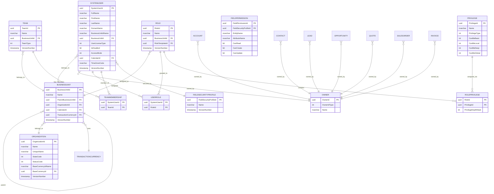

### 1.3 Activity & Communication Entities ERD

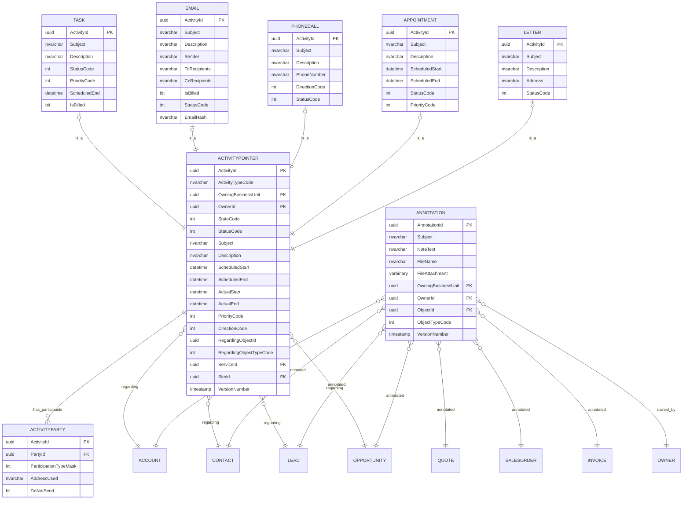

---

## SECTION 2 – Database Table Structure Flow

### 2.1 Core Entity Class Diagram

```mermaid
classDiagram
    %% ==================== ACCOUNT ENTITY ====================
    class AccountBase {
        +uuid AccountId PK
        +nvarchar AccountNumber
        +nvarchar Name
        +uuid OwningBusinessUnit FK
        +uuid OwnerId FK
        +int OwnerIdType
        +int StateCode
        +int StatusCode
        +uuid ParentAccountId FK
        +uuid PrimaryContactId FK
        +money Revenue
        +int NumberOfEmployees
        +nvarchar Telephone1
        +nvarchar EmailAddress1
        +timestamp VersionNumber
    }
    
    %% ==================== LEAD ENTITY ====================
    class LeadBase {
        +uuid LeadId PK
        +nvarchar Subject
        +nvarchar FirstName
        +nvarchar LastName
        +nvarchar CompanyName
        +nvarchar EmailAddress
        +nvarchar Telephone
        +uuid OwningBusinessUnit FK
        +uuid OwnerId FK
        +int OwnerIdType
        +int StateCode
        +int StatusCode
        +int IndustryCode
        +int LeadSourceCode
        +int RatingCode
        +timestamp VersionNumber
    }
    
    %% ==================== OPPORTUNITY ENTITY ====================
    class OpportunityBase {
        +uuid OpportunityId PK
        +nvarchar Name
        +uuid OwningBusinessUnit FK
        +uuid OwnerId FK
        +int OwnerIdType
        +int StateCode
        +int StatusCode
        +uuid CustomerId
        +int CustomerIdType
        +uuid PriceLevelId FK
        +uuid TransactionCurrencyId FK
        +money EstimatedValue
        +money ActualValue
        +int CloseProbability
        +datetime EstimatedCloseDate
        +datetime ActualCloseDate
        +int SalesStageCode
        +money TotalAmount
        +timestamp VersionNumber
    }
    
    %% ==================== QUOTE ENTITY ====================
    class QuoteBase {
        +uuid QuoteId PK
        +nvarchar QuoteNumber
        +int RevisionNumber
        +nvarchar Name
        +uuid OwningBusinessUnit FK
        +uuid OwnerId FK
        +int OwnerIdType
        +int StateCode
        +int StatusCode
        +uuid CustomerId
        +int CustomerIdType
        +uuid PriceLevelId FK
        +uuid TransactionCurrencyId FK
        +uuid OpportunityId FK
        +money TotalAmount
        +datetime EffectiveFrom
        +datetime EffectiveTo
        +datetime ExpiresOn
        +timestamp VersionNumber
    }
    
    %% ==================== SALES ORDER ENTITY ====================
    class SalesOrderBase {
        +uuid SalesOrderId PK
        +nvarchar OrderNumber
        +uuid OwningBusinessUnit FK
        +uuid OwnerId FK
        +int OwnerIdType
        +int StateCode
        +int StatusCode
        +uuid CustomerId
        +int CustomerIdType
        +uuid PriceLevelId FK
        +uuid TransactionCurrencyId FK
        +uuid OpportunityId FK
        +uuid QuoteId FK
        +money TotalAmount
        +datetime RequestDeliveryBy
        +int SubmitStatus
        +timestamp VersionNumber
    }
    
    %% ==================== INVOICE ENTITY ====================
    class InvoiceBase {
        +uuid InvoiceId PK
        +nvarchar InvoiceNumber
        +uuid OwningBusinessUnit FK
        +uuid OwnerId FK
        +int OwnerIdType
        +int StateCode
        +int StatusCode
        +uuid CustomerId
        +int CustomerIdType
        +uuid PriceLevelId FK
        +uuid TransactionCurrencyId FK
        +uuid SalesOrderId FK
        +uuid OpportunityId FK
        +money TotalAmount
        +int PaymentTermsCode
        +datetime DueDate
        +timestamp VersionNumber
    }
    
    %% ==================== SYSTEM ATTRIBUTES MIXIN ====================
    class SystemAttributes {
        <<mixin>>
        +datetime CreatedOn
        +uuid CreatedBy
        +datetime ModifiedOn
        +uuid ModifiedBy
        +timestamp VersionNumber
    }
    
    class OwnershipAttributes {
        <<mixin>>
        +uuid OwnerId
        +int OwnerIdType
        +uuid OwningBusinessUnit
    }
    
    class StateManagementAttributes {
        <<mixin>>
        +int StateCode
        +int StatusCode
    }
    
    %% Apply mixins
    AccountBase ..|> SystemAttributes
    AccountBase ..|> OwnershipAttributes
    AccountBase ..|> StateManagementAttributes
    
    LeadBase ..|> SystemAttributes
    LeadBase ..|> OwnershipAttributes
    LeadBase ..|> StateManagementAttributes
    
    OpportunityBase ..|> SystemAttributes
    OpportunityBase ..|> OwnershipAttributes
    OpportunityBase ..|> StateManagementAttributes
    
    QuoteBase ..|> SystemAttributes
    QuoteBase ..|> OwnershipAttributes
    QuoteBase ..|> StateManagementAttributes
    
    SalesOrderBase ..|> SystemAttributes
    SalesOrderBase ..|> OwnershipAttributes
    SalesOrderBase ..|> StateManagementAttributes
    
    InvoiceBase ..|> SystemAttributes
    InvoiceBase ..|> OwnershipAttributes
    InvoiceBase ..|> StateManagementAttributes
```

---

## SECTION 3 – CRM Business Process Flow

### 3.1 Lead to Cash Pipeline Flow

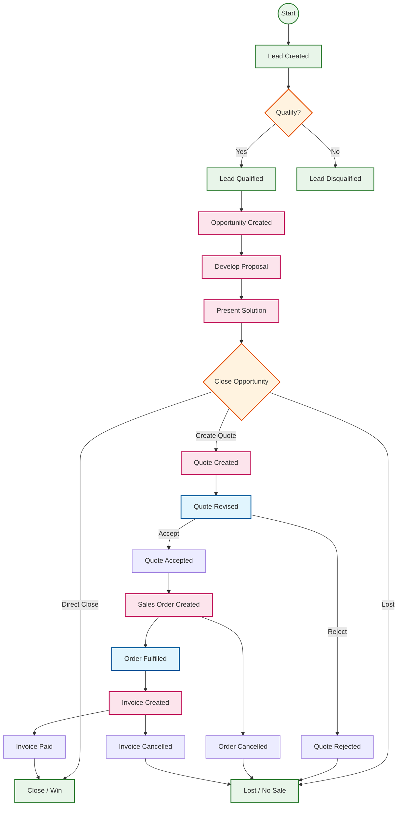

### 3.2 Lead State Transition Flow

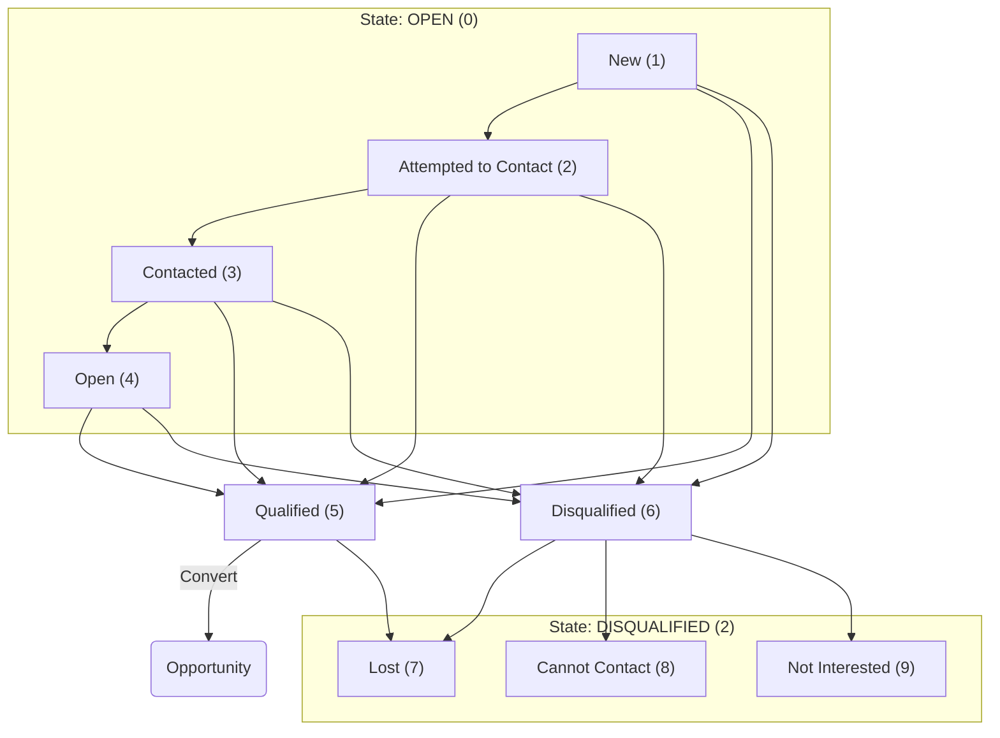

### 3.3 Opportunity State Transition Flow

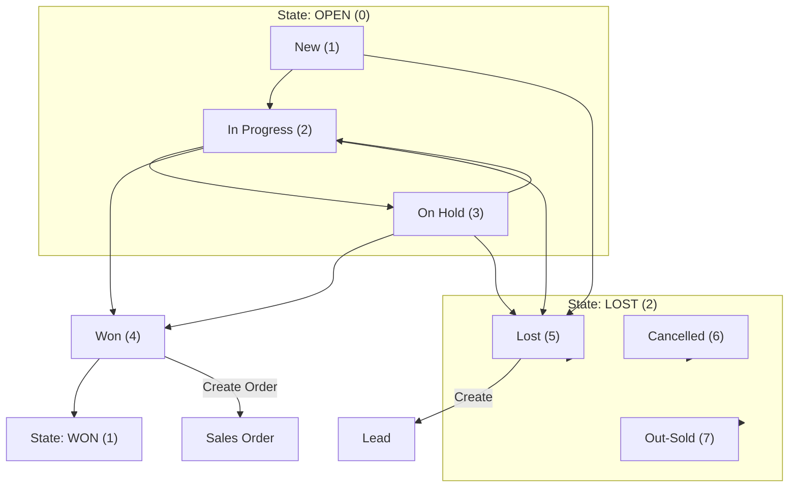

---

## SECTION 4 – Data Flow Diagram (DFD)

### 4.1 CRM Data Flow Architecture

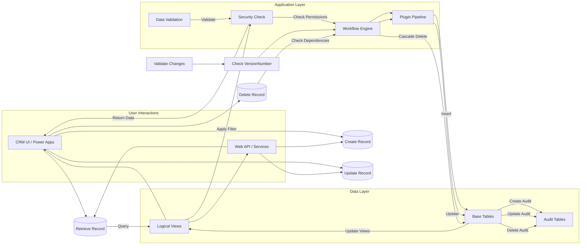

### 4.2 Record Lifecycle Data Flow

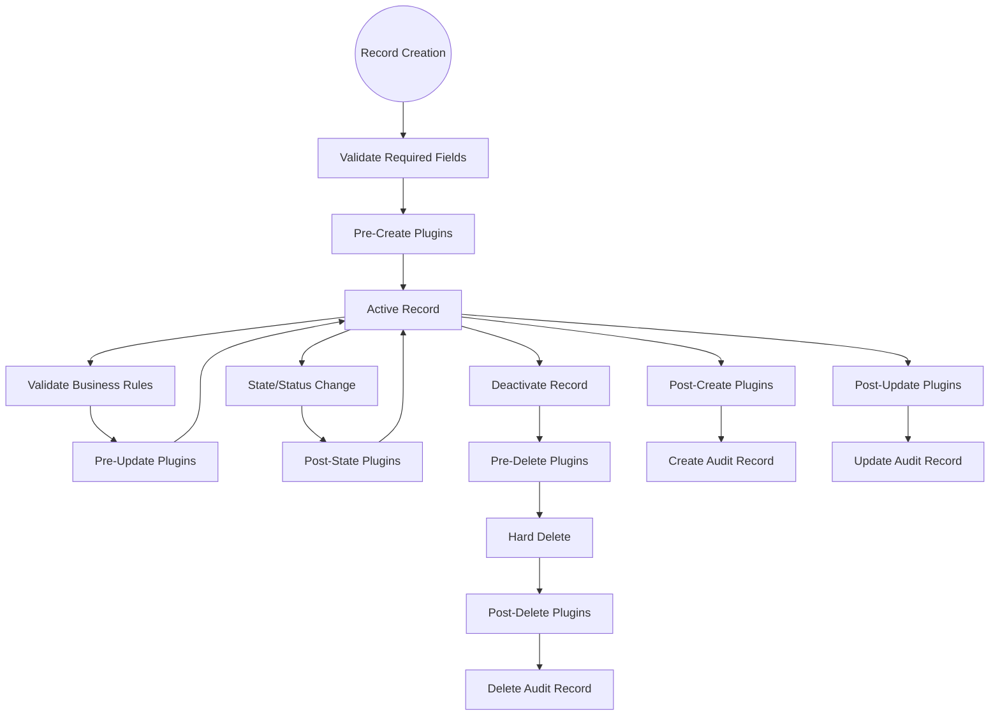

---

## SECTION 5 – Security Model Diagram

### 5.1 CRM Security Architecture

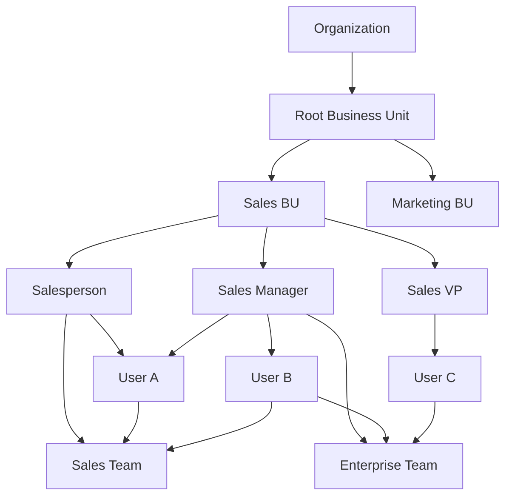

### 5.2 Record-Level Security Flow

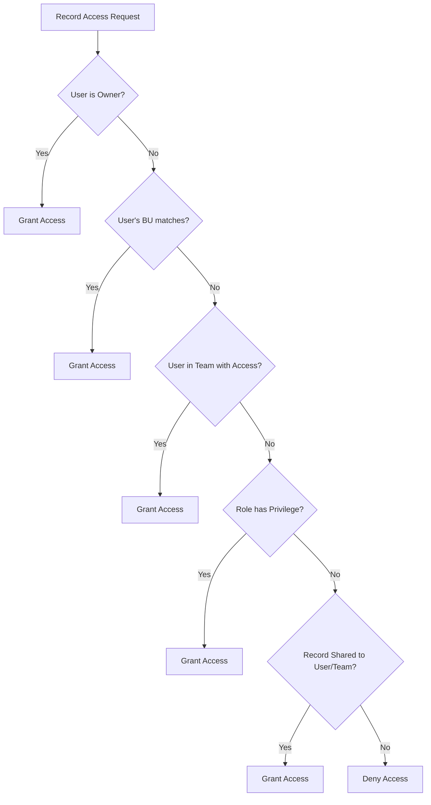

---

## SECTION 6 – Activity & Timeline Relationship Diagram

### 6.1 Activity Party Model

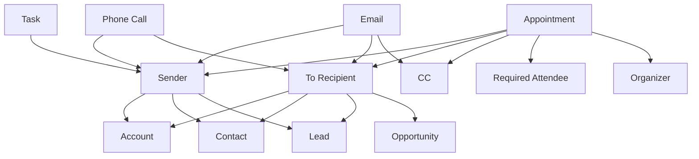

### 6.2 Timeline Integration Flow

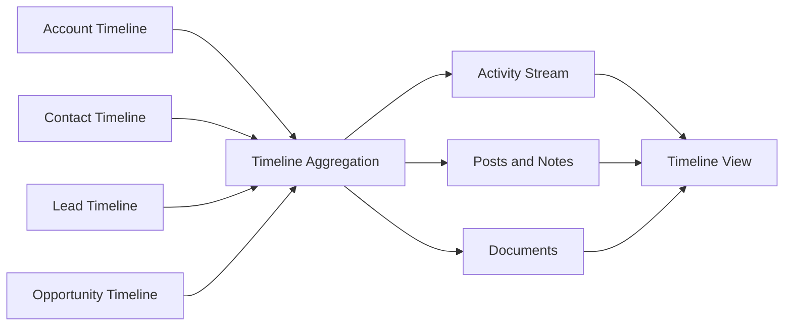

---

## SECTION 7 – Financial Calculation Flow

### 7.1 Pricing Calculation Flow

```mermaid
flowchart TD
    START(("Pricing Calculation"))
    
    PRODUCT["Product Selection"]
    PRICELIST["Price List Lookup"]
    GET_PRICE["Get Unit Price"]
    LINE_QTY["Enter Quantity"]
    LINE_PRICE["Unit Price"]
    LINE_CALC["Calculate Line Amount"]
    LINE_AMOUNT["Line Amount"]
    LINE_DISCOUNT["Line Discount"]
    DISCOUNT_CALC["Calculate Discount"]
    DISCOUNT_AMT["Discount Amount"]
    NET_LINE["Net Line Amount"]
    TOTAL_LINES["Sum All Lines"]
    SUBTOTAL["Subtotal"]
    ORDER_DISCOUNT["Order Discount"]
    ORDER_DISCOUNT_AMT["Order Discount Amount"]
    NET_SUBTOTAL["Net Subtotal"]
    FREIGHT["Freight Amount"]
    TAX_CALC["Calculate Tax"]
    TAX_AMT["Tax Amount"]
    TOTAL_CALC["Calculate Total"]
    TOTAL_AMOUNT["Total Amount"]
    TRANSACTION_CURRENCY["Transaction Currency"]
    EXCHANGE_RATE["Exchange Rate"]
    BASE_AMOUNT["Base Currency Amount"]
    
    START --> PRODUCT
    PRODUCT --> PRICELIST
    PRICELIST --> GET_PRICE
    GET_PRICE --> LINE_PRICE
    LINE_QTY --> LINE_CALC
    LINE_PRICE --> LINE_CALC
    LINE_CALC --> LINE_AMOUNT
    LINE_AMOUNT --> LINE_DISCOUNT
    LINE_DISCOUNT --> DISCOUNT_CALC
    DISCOUNT_CALC --> DISCOUNT_AMT
    DISCOUNT_AMT --> NET_LINE
    NET_LINE --> TOTAL_LINES
    TOTAL_LINES --> SUBTOTAL
    SUBTOTAL --> ORDER_DISCOUNT
    ORDER_DISCOUNT --> ORDER_DISCOUNT_AMT
    ORDER_DISCOUNT_AMT --> NET_SUBTOTAL
    NET_SUBTOTAL --> FREIGHT
    FREIGHT --> TAX_CALC
    TAX_CALC --> TAX_AMT
    TAX_AMT --> TOTAL_CALC
    TOTAL_CALC --> TOTAL_AMOUNT
    TOTAL_AMOUNT --> TRANSACTION_CURRENCY
    TRANSACTION_CURRENCY --> EXCHANGE_RATE
    EXCHANGE_RATE --> BASE_AMOUNT
    
    class START,TOTAL_AMOUNT,BASE_AMOUNT fill:#e3f2fd,stroke:#1565c0
    class PRODUCT,PRICELIST,GET_PRICE fill:#c8e6c9,stroke:#2e7d32
    class LINE_QTY,LINE_PRICE,LINE_CALC fill:#fff8e1,stroke:#ff8f00
    class DISCOUNT_AMT,ORDER_DISCOUNT_AMT,TAX_AMT fill:#fce4ec,stroke:#c2185b
    class SUBTOTAL,NET_SUBTOTAL fill:#f3e5f5,stroke:#7b1fa2
```

### 7.2 Multi-Currency Conversion Flow

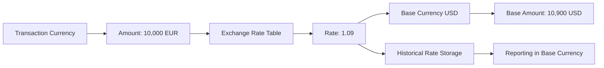

---

*Document generated for Microsoft Dynamics 365 CRM Sales Module*
*All diagrams follow standard Mermaid syntax and Enterprise Dynamics 365 / Dataverse architecture patterns*
