# Microsoft Dynamics 365 CRM Sales Module
## Enterprise Mermaid Diagrams - Data Structure & Data Flow

**Document Classification**: Enterprise Architecture Visual Documentation  
**Author**: Senior Microsoft Dynamics 365 CRM Solution Architect & Dataverse Database Expert  
**Database**: CRM_DB (SQL Server)  
**Date**: January 2026

---

## SECTION 1 – Entity Relationship Diagram (ERD)

### 1.1 Core Sales Entities ERD

```mermaid
erDiagram
    %% ==================== CORE SALES ENTITIES ====================
    
    ACCOUNT {
        uuid AccountId PK
        nvarchar AccountNumber
        nvarchar Name
        uuid OwningBusinessUnit FK
        uuid OwnerId FK
        int StateCode
        int StatusCode
        uuid ParentAccountId FK
        uuid PrimaryContactId FK
        uuid MasterId FK
        int IndustryCode
        money Revenue
        int NumberOfEmployees
        timestamp VersionNumber
    }
    
    CONTACT {
        uuid ContactId PK
        nvarchar FirstName
        nvarchar LastName
        nvarchar FullName
        nvarchar EmailAddress1
        nvarchar Telephone1
        uuid OwningBusinessUnit FK
        uuid OwnerId FK
        uuid ParentCustomerId FK
        int ParentCustomerIdType
        uuid MasterId FK
        int StateCode
        int StatusCode
        timestamp VersionNumber
    }
    
    LEAD {
        uuid LeadId PK
        nvarchar Subject
        nvarchar FirstName
        nvarchar LastName
        nvarchar CompanyName
        nvarchar EmailAddress
        nvarchar Telephone
        uuid OwningBusinessUnit FK
        uuid OwnerId FK
        int StateCode
        int StatusCode
        uuid CampaignId FK
        uuid QualifyingOpportunityId FK
        uuid ParentAccountId FK
        uuid ParentContactId FK
        uuid OriginatingLeadId FK
        int IndustryCode
        int LeadSourceCode
        nvarchar TraversedPath
        timestamp VersionNumber
    }
    
    OPPORTUNITY {
        uuid OpportunityId PK
        nvarchar Name
        uuid OwningBusinessUnit FK
        uuid OwnerId FK
        int StateCode
        int StatusCode
        uuid CustomerId
        int CustomerIdType
        uuid PriceLevelId FK
        uuid TransactionCurrencyId FK
        money EstimatedValue
        money EstimatedValue_Base
        money ActualValue
        money TotalAmount
        int CloseProbability
        datetime EstimatedCloseDate
        datetime ActualCloseDate
        int SalesStageCode
        nvarchar SalesStage
        uuid OriginatingLeadId FK
        uuid CampaignId FK
        nvarchar TraversedPath
        timestamp VersionNumber
    }
    
    QUOTE {
        uuid QuoteId PK
        nvarchar QuoteNumber
        int RevisionNumber
        nvarchar Name
        uuid OwningBusinessUnit FK
        uuid OwnerId FK
        int StateCode
        int StatusCode
        uuid CustomerId
        int CustomerIdType
        uuid PriceLevelId FK
        uuid TransactionCurrencyId FK
        uuid OpportunityId FK
        money TotalAmount
        money DiscountAmount
        money FreightAmount
        money TotalTax
        datetime EffectiveFrom
        datetime EffectiveTo
        datetime ExpiresOn
        timestamp VersionNumber
    }
    
    SALESORDER {
        uuid SalesOrderId PK
        nvarchar OrderNumber
        uuid OwningBusinessUnit FK
        uuid OwnerId FK
        int StateCode
        int StatusCode
        uuid CustomerId
        int CustomerIdType
        uuid PriceLevelId FK
        uuid TransactionCurrencyId FK
        uuid OpportunityId FK
        uuid QuoteId FK
        money TotalAmount
        money DiscountAmount
        money FreightAmount
        money TotalTax
        datetime RequestDeliveryBy
        int SubmitStatus
        timestamp VersionNumber
    }
    
    INVOICE {
        uuid InvoiceId PK
        nvarchar InvoiceNumber
        uuid OwningBusinessUnit FK
        uuid OwnerId FK
        int StateCode
        int StatusCode
        uuid CustomerId
        int CustomerIdType
        uuid PriceLevelId FK
        uuid TransactionCurrencyId FK
        uuid SalesOrderId FK
        uuid OpportunityId FK
        money TotalAmount
        money TotalTax
        datetime DueDate
        int PaymentTermsCode
        timestamp VersionNumber
    }
    
    %% ==================== PRODUCT & PRICING ENTITIES ====================
    
    PRODUCT {
        uuid ProductId PK
        nvarchar Name
        nvarchar ProductNumber
        int StateCode
        int StatusCode
        uuid DefaultUoMId FK
        uuid PriceLevelId FK
        money QuantityDecimal
        int ProductTypeCode
        timestamp VersionNumber
    }
    
    PRICELIST {
        uuid PriceLevelId PK
        nvarchar Name
        int StateCode
        int StatusCode
        uuid TransactionCurrencyId FK
        datetime BeginDate
        datetime EndDate
        bit IsDefault
        timestamp VersionNumber
    }
    
    PRICELISTITEM {
        uuid ProductPriceLevelId PK
        uuid PriceLevelId FK
        uuid ProductId FK
        money Amount
        decimal Percentage
        money FloorPrice
        money CeilingPrice
        timestamp VersionNumber
    }
    
    UOM {
        uuid UoMId PK
        nvarchar Name
        uuid UoMScheduleId FK
        timestamp VersionNumber
    }
    
    UOMSCHEDULE {
        uuid UoMScheduleId PK
        nvarchar Name
        timestamp VersionNumber
    }
    
    DISCOUNTTYPE {
        uuid DiscountTypeId PK
        nvarchar Name
        int Type
        uuid TransactionCurrencyId FK
        timestamp VersionNumber
    }
    
    DISCOUNT {
        uuid DiscountId PK
        uuid DiscountTypeId FK
        int LowQuantity
        int HighQuantity
        decimal Percentage
        money Amount
        uuid TransactionCurrencyId FK
        timestamp VersionNumber
    }
    
    TRANSACTIONCURRENCY {
        uuid TransactionCurrencyId PK
        nvarchar ISOCurrencyCode
        nvarchar CurrencyName
        string CurrencySymbol
        int Precision
        timestamp VersionNumber
    }
    
    %% ==================== LINE ITEM ENTITIES ====================
    
    OPPORTUNITYPRODUCT {
        uuid OpportunityProductId PK
        uuid OpportunityId FK
        uuid ProductId FK
        uuid UoMId FK
        int Quantity
        money UnitPrice
        money ExtendedAmount
        money LineItemDiscount
        decimal LineItemDiscountPercentage
        money Tax
        timestamp VersionNumber
    }
    
    QUOTEDETAIL {
        uuid QuoteDetailId PK
        uuid QuoteId FK
        uuid ProductId FK
        uuid UoMId FK
        int Quantity
        money UnitPrice
        money ExtendedAmount
        money LineItemDiscount
        decimal LineItemDiscountPercentage
        money Tax
        timestamp VersionNumber
    }
    
    ORDERDETAIL {
        uuid SalesOrderDetailId PK
        uuid SalesOrderId FK
        uuid ProductId FK
        uuid UoMId FK
        int Quantity
        money UnitPrice
        money ExtendedAmount
        money LineItemDiscount
        decimal LineItemDiscountPercentage
        money Tax
        timestamp VersionNumber
    }
    
    INVOICEDETAIL {
        uuid InvoiceDetailId PK
        uuid InvoiceId FK
        uuid ProductId FK
        uuid UoMId FK
        int Quantity
        money UnitPrice
        money ExtendedAmount
        money LineItemDiscount
        decimal LineItemDiscountPercentage
        money Tax
        timestamp VersionNumber
    }
    
    %% ==================== RELATIONSHIPS ====================
    
    ACCOUNT ||--o{ CONTACT : "has_primary"
    ACCOUNT ||--o{ OPPORTUNITY : "generates"
    ACCOUNT ||--o{ QUOTE : "creates"
    ACCOUNT ||--o{ SALESORDER : "orders"
    ACCOUNT ||--o{ INVOICE : "billed"
    ACCOUNT ||--o{ ACCOUNT : "parent_child"
    ACCOUNT ||--o{ LEAD : "originates"
    ACCOUNT }o--|| PRICELIST : "uses"
    
    CONTACT ||--o{ OPPORTUNITY : "associated"
    CONTACT ||--o{ LEAD : "qualifies"
    CONTACT--o{ QU ||OTE : "receives"
    CONTACT ||--o{ SALESORDER : "purchases"
    CONTACT ||--o{ INVOICE : "receives"
    CONTACT }o--|| ACCOUNT : "belongs_to"
    
    LEAD ||--o{ LEAD : "self_referential"
    LEAD }o--|| CAMPAIGN : "source"
    LEAD ||--o{ OPPORTUNITY : "qualifies_to"
    LEAD }o--|| ACCOUNT : "becomes"
    LEAD }o--|| CONTACT : "becomes"
    
    OPPORTUNITY ||--o{ OPPORTUNITYPRODUCT : "contains"
    OPPORTUNITY ||--o{ QUOTE : "generates"
    OPPORTUNITY ||--o{ SALESORDER : "creates"
    OPPORTUNITY ||--o{ INVOICE : "creates"
    OPPORTUNITY }o--|| LEAD : "originates"
    OPPORTUNITY }o--|| ACCOUNT : "customer"
    OPPORTUNITY }o--|| CONTACT : "customer"
    OPPORTUNITY }o--|| PRICELIST : "uses"
    
    QUOTE ||--o{ QUOTEDETAIL : "contains"
    QUOTE }o--|| OPPORTUNITY : "from"
    QUOTE ||--o{ SALESORDER : "converts_to"
    
    SALESORDER ||--o{ ORDERDETAIL : "contains"
    SALESORDER }o--|| QUOTE : "from"
    SALESORDER ||--o{ INVOICE : "invoices"
    
    INVOICE ||--o{ INVOICEDETAIL : "contains"
    INVOICE }o--|| SALESORDER : "from"
    
    PRODUCT ||--o{ OPPORTUNITYPRODUCT : "sold_in"
    PRODUCT ||--o{ QUOTEDETAIL : "quoted"
    PRODUCT ||--o{ ORDERDETAIL : "ordered"
    PRODUCT ||--o{ INVOICEDETAIL : "invoiced"
    PRODUCT }o--|| PRICELIST : "priced_in"
    PRODUCT }o--|| UOM : "measured_in"
    
    PRICELIST ||--o{ PRICELISTITEM : "contains"
    
    UOMSCHEDULE ||--o{ UOM : "contains"
    
    DISCOUNTTYPE ||--o{ DISCOUNT : "defines"
```

### 1.2 Security & Organization Entities ERD

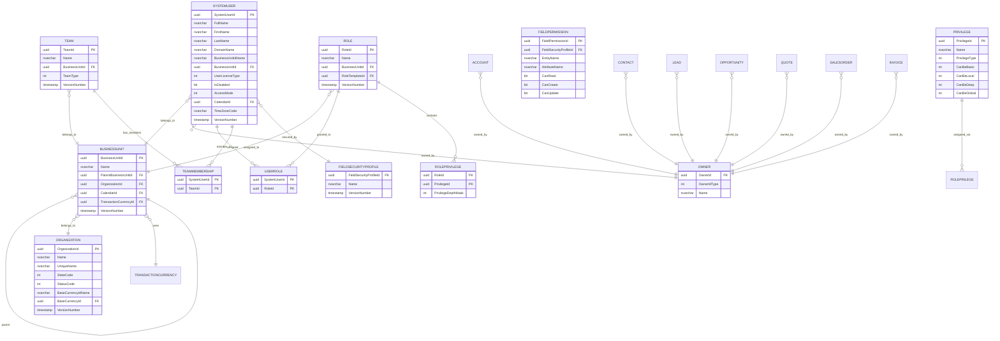

### 1.3 Activity & Communication Entities ERD

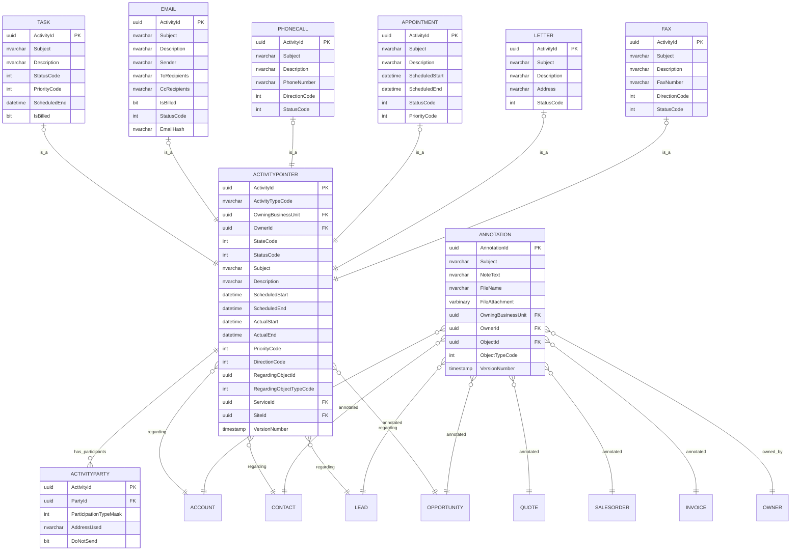

---

## SECTION 2 – Database Table Structure Flow

### 2.1 Core Entity Class Diagram

```mermaid
classDiagram
    %% ==================== ACCOUNT ENTITY ====================
    class AccountBase {
        +uuid AccountId PK
        +nvarchar AccountNumber
        +nvarchar Name
        +uuid OwningBusinessUnit FK
        +uuid OwnerId FK
        +int OwnerIdType
        +int StateCode
        +int StatusCode
        +uuid ParentAccountId FK
        +uuid PrimaryContactId FK
        +uuid MasterId FK
        +int IndustryCode
        +int BusinessTypeCode
        +money Revenue
        +int NumberOfEmployees
        +nvarchar Telephone1
        +nvarchar EmailAddress1
        +nvarchar WebsiteUrl
        +int AccountRatingCode
        +bit CreditOnHold
        +uuid TerritoryId FK
        +uuid DefaultPriceLevelId FK
        +datetime CreatedOn
        +uuid CreatedBy FK
        +datetime ModifiedOn
        +uuid ModifiedBy FK
        +datetime CreatedOnBehalfBy
        +datetime ModifiedOnBehalfBy
        +timestamp VersionNumber
        +int ImportSequenceNumber
        +datetime OverriddenCreatedOn
        +int UTCConversionTimeZoneCode
        +int TimeZoneRuleVersionNumber
        +uuid ProcessId
        +uuid StageId
        +nvarchar TraversedPath
    }
    
    %% ==================== LEAD ENTITY ====================
    class LeadBase {
        +uuid LeadId PK
        +nvarchar Subject
        +nvarchar FirstName
        +nvarchar LastName
        +nvarchar CompanyName
        +nvarchar EmailAddress
        +nvarchar Telephone
        +uuid OwningBusinessUnit FK
        +uuid OwnerId FK
        +int OwnerIdType
        +int StateCode
        +int StatusCode
        +int IndustryCode
        +int LeadSourceCode
        +int RatingCode
        +uuid CampaignId FK
        +uuid QualifyingOpportunityId FK
        +uuid ParentAccountId FK
        +uuid ParentContactId FK
        +uuid OriginatingLeadId FK
        +bit DoNotPhone
        +bit DoNotEmail
        +bit DoNotPostalMail
        +datetime CreatedOn
        +uuid CreatedBy FK
        +datetime ModifiedOn
        +uuid ModifiedBy FK
        +timestamp VersionNumber
        +nvarchar TraversedPath
        +uuid ProcessId
        +uuid StageId
    }
    
    %% ==================== OPPORTUNITY ENTITY ====================
    class OpportunityBase {
        +uuid OpportunityId PK
        +nvarchar Name
        +uuid OwningBusinessUnit FK
        +uuid OwnerId FK
        +int OwnerIdType
        +int StateCode
        +int StatusCode
        +uuid CustomerId
        +int CustomerIdType
        +nvarchar CustomerIdName
        +uuid PriceLevelId FK
        +uuid TransactionCurrencyId FK
        +money EstimatedValue
        +money EstimatedValue_Base
        +money ActualValue
        +money ActualValue_Base
        +int CloseProbability
        +datetime EstimatedCloseDate
        +datetime ActualCloseDate
        +int SalesStageCode
        +nvarchar SalesStage
        +uuid CampaignId FK
        +uuid OriginatingLeadId FK
        +money TotalAmount
        +money TotalAmount_Base
        +money DiscountAmount
        +money DiscountPercentage
        +money FreightAmount
        +money TotalTax
        +money TotalLineItemAmount
        +money TotalDiscountAmount
        +money TotalAmountLessFreight
        +datetime CreatedOn
        +uuid CreatedBy FK
        +datetime ModifiedOn
        +uuid ModifiedBy FK
        +timestamp VersionNumber
        +nvarchar TraversedPath
        +uuid ProcessId
        +uuid StageId
    }
    
    %% ==================== QUOTE ENTITY ====================
    class QuoteBase {
        +uuid QuoteId PK
        +nvarchar QuoteNumber
        +int RevisionNumber
        +nvarchar Name
        +uuid OwningBusinessUnit FK
        +uuid OwnerId FK
        +int OwnerIdType
        +int StateCode
        +int StatusCode
        +uuid CustomerId
        +int CustomerIdType
        +uuid PriceLevelId FK
        +uuid TransactionCurrencyId FK
        +uuid OpportunityId FK
        +money TotalAmount
        +money TotalAmount_Base
        +money DiscountAmount
        +money DiscountPercentage
        +money FreightAmount
        +money TotalTax
        +money TotalLineItemAmount
        +money TotalDiscountAmount
        +money TotalAmountLessFreight
        +datetime EffectiveFrom
        +datetime EffectiveTo
        +datetime ExpiresOn
        +datetime RequestDeliveryBy
        +datetime ClosedOn
        +int ShippingMethodCode
        +int PaymentTermsCode
        +datetime CreatedOn
        +timestamp VersionNumber
    }
    
    %% ==================== SALES ORDER ENTITY ====================
    class SalesOrderBase {
        +uuid SalesOrderId PK
        +nvarchar OrderNumber
        +uuid OwningBusinessUnit FK
        +uuid OwnerId FK
        +int OwnerIdType
        +int StateCode
        +int StatusCode
        +uuid CustomerId
        +int CustomerIdType
        +uuid PriceLevelId FK
        +uuid TransactionCurrencyId FK
        +uuid OpportunityId FK
        +uuid QuoteId FK
        +money TotalAmount
        +money TotalAmount_Base
        +money DiscountAmount
        +money FreightAmount
        +money TotalTax
        +datetime RequestDeliveryBy
        +int SubmitStatus
        +datetime SubmitDate
        +datetime LastBackofficeSubmit
        +datetime CreatedOn
        +timestamp VersionNumber
    }
    
    %% ==================== INVOICE ENTITY ====================
    class InvoiceBase {
        +uuid InvoiceId PK
        +nvarchar InvoiceNumber
        +uuid OwningBusinessUnit FK
        +uuid OwnerId FK
        +int OwnerIdType
        +int StateCode
        +int StatusCode
        +uuid CustomerId
        +int CustomerIdType
        +uuid PriceLevelId FK
        +uuid TransactionCurrencyId FK
        +uuid SalesOrderId FK
        +uuid OpportunityId FK
        +money TotalAmount
        +money TotalAmount_Base
        +money DiscountAmount
        +money FreightAmount
        +money TotalTax
        +int PaymentTermsCode
        +datetime DueDate
        +datetime DateSent
        +datetime PaidOn
        +datetime CreatedOn
        +timestamp VersionNumber
    }
    
    %% ==================== SYSTEM ATTRIBUTES MIXIN ====================
    class SystemAttributes {
        <<mixin>>
        +datetime CreatedOn
        +uuid CreatedBy
        +datetime ModifiedOn
        +uuid ModifiedBy
        +datetime CreatedOnBehalfBy
        +datetime ModifiedOnBehalfBy
        +timestamp VersionNumber
    }
    
    class OwnershipAttributes {
        <<mixin>>
        +uuid OwnerId
        +int OwnerIdType
        +uuid OwningBusinessUnit
    }
    
    class StateManagementAttributes {
        <<mixin>>
        +int StateCode
        +int StatusCode
    }
    
    class AuditAttributes {
        <<mixin>>
        +int ImportSequenceNumber
        +datetime OverriddenCreatedOn
        +int UTCConversionTimeZoneCode
        +int TimeZoneRuleVersionNumber
    }
    
    class BPFAttributes {
        <<mixin>>
        +uuid ProcessId
        +uuid StageId
        +nvarchar TraversedPath
    }
    
    %% Apply mixins
    AccountBase ..|> SystemAttributes
    AccountBase ..|> OwnershipAttributes
    AccountBase ..|> StateManagementAttributes
    AccountBase ..|> AuditAttributes
    AccountBase ..|> BPFAttributes
    
    LeadBase ..|> SystemAttributes
    LeadBase ..|> OwnershipAttributes
    LeadBase ..|> StateManagementAttributes
    LeadBase ..|> AuditAttributes
    LeadBase ..|> BPFAttributes
    
    OpportunityBase ..|> SystemAttributes
    OpportunityBase ..|> OwnershipAttributes
    OpportunityBase ..|> StateManagementAttributes
    OpportunityBase ..|> AuditAttributes
    OpportunityBase ..|> BPFAttributes
    
    QuoteBase ..|> SystemAttributes
    QuoteBase ..|> OwnershipAttributes
    QuoteBase ..|> StateManagementAttributes
    QuoteBase ..|> AuditAttributes
    
    SalesOrderBase ..|> SystemAttributes
    SalesOrderBase ..|> OwnershipAttributes
    SalesOrderBase ..|> StateManagementAttributes
    SalesOrderBase ..|> AuditAttributes
    
    InvoiceBase ..|> SystemAttributes
    InvoiceBase ..|> OwnershipAttributes
    InvoiceBase ..|> StateManagementAttributes
    InvoiceBase ..|> AuditAttributes
```

### 2.2 StateCode & StatusCode Structure

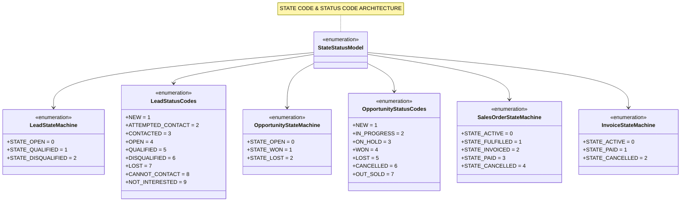

---

## SECTION 3 – CRM Business Process Flow

### 3.1 Lead to Cash Pipeline Flow

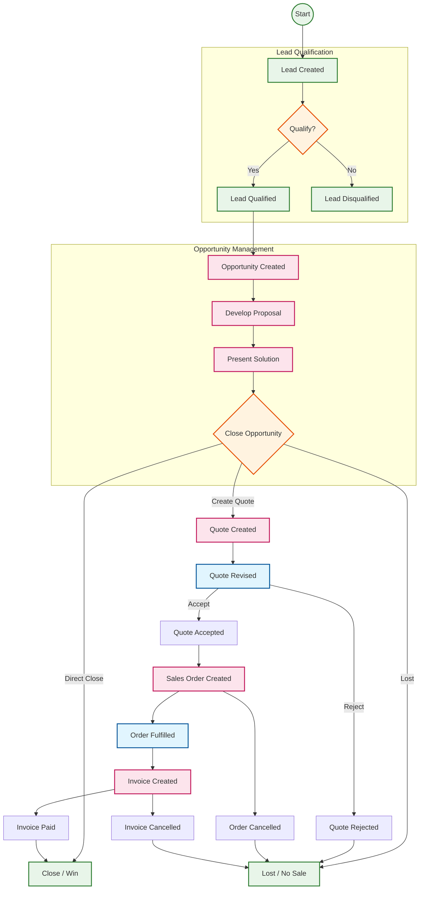

### 3.2 Lead State Transition Flow

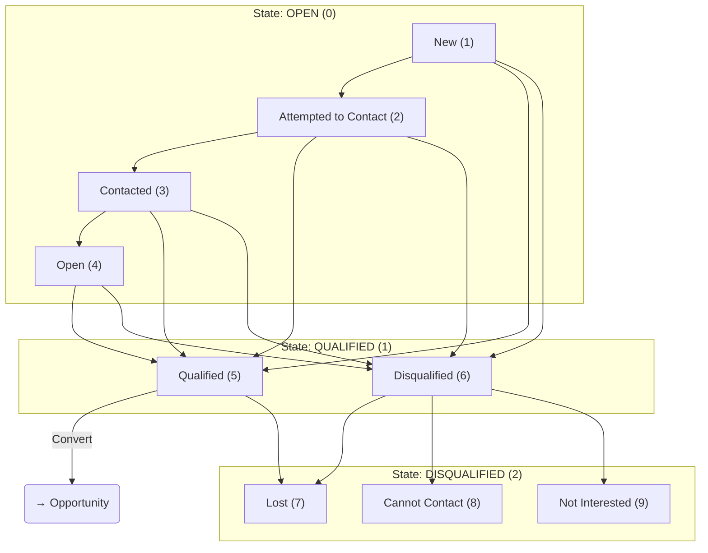

### 3.3 Opportunity State Transition Flow

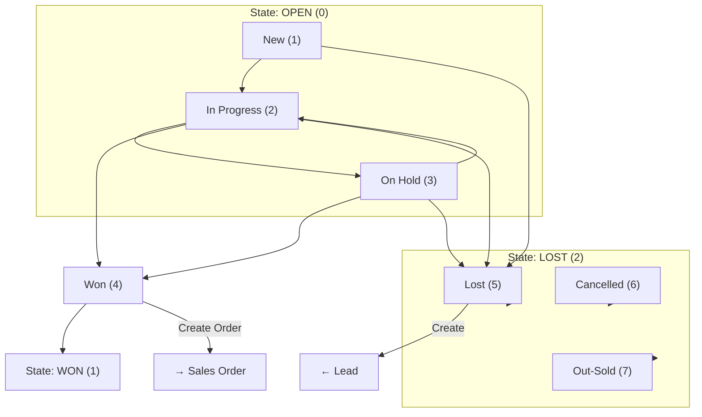

---

## SECTION 4 – Data Flow Diagram (DFD)

### 4.1 CRM Data Flow Architecture

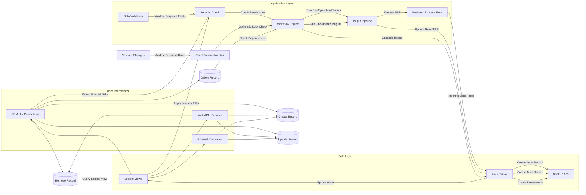

### 4.2 Record Lifecycle Data Flow

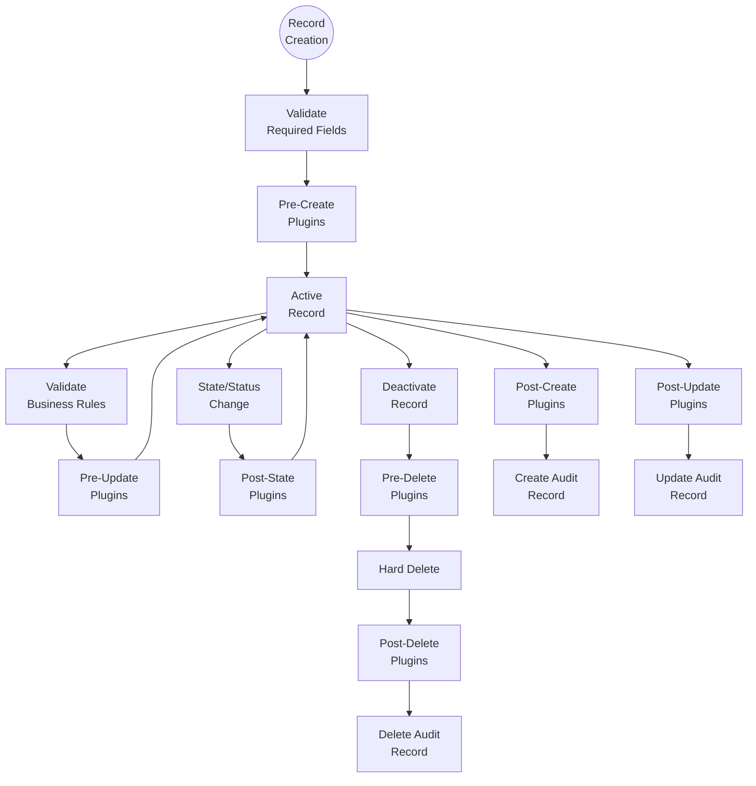

---

## SECTION 5 – Security Model Diagram

### 5.1 CRM Security Architecture

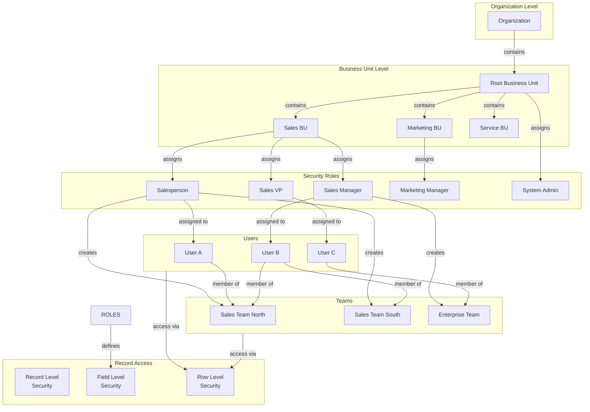

### 5.2 Record-Level Security Flow

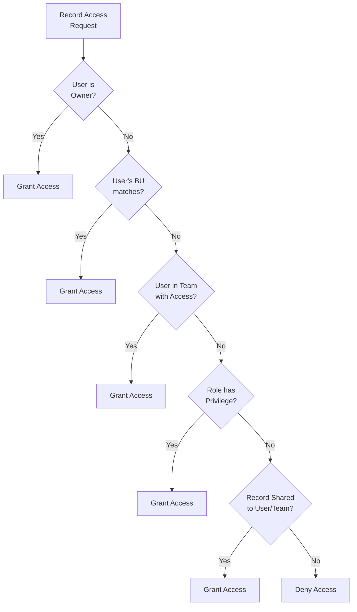

---

## SECTION 6 – Activity & Timeline Relationship Diagram

### 6.1 Activity Party Model

```mermaid
flowchart TB
    %% ==================== ACTIVITY RELATIONSHIPS ====================
    
    subgraph ACTIVITIES["Activities"]
        APPT["Appointment"]
        EMAIL["Email"]
        PHONE["Phone Call"]
        TASK["Task"]
        LETTER["Letter"]
        FAX["Fax"]
        SOCIAL["Social Activity"]
        SERVICE["Service Appointment"]
    end
    
    subgraph PARTICIPANTS["Activity Parties"]
        SENDER["Sender (1)"]
        TO["To Recipient (2)"]
        CC["CC (3)"]
        BCC["BCC (4)"]
        REQUIRED["Required Attendee (5)"]
        OPTIONAL["Optional Attendee (6)"]
        ORGANIZER["Organizer (7)"]
        REGARDING["Regarding (8)"]
    end
    
    subgraph REGARDING_ENTITIES["Regarding Entities"]
        ACCOUNT_ACT["Account"]
        CONTACT_ACT["Contact"]
        LEAD_ACT["Lead"]
        OPP_ACT["Opportunity"]
        CASE_ACT["Case"]
        QUOTE_ACT["Quote"]
        ORDER_ACT["Sales Order"]
        INVOICE_ACT["Invoice"]
    end
    
    %% Activity to Participant
    APPT -->|has| SENDER
    APPT -->|has| TO
    APPT -->|has| CC
    APPT -->|has| REQUIRED
    APPT -->|has| OPTIONAL
    APPT -->|has| ORGANIZER
    
    EMAIL -->|from| SENDER
    EMAIL -->|to| TO
    EMAIL -->|cc| CC
    EMAIL -->|bcc| BCC
    
    PHONE -->|from| SENDER
    PHONE -->|to| TO
    
    TASK -->|assigned_to| REGARDING
    TASK -->|has| SENDER
    
    %% Participant to Regarding
    SENDER --> ACCOUNT_ACT
    SENDER --> CONTACT_ACT
    SENDER --> LEAD_ACT
    
    TO --> ACCOUNT_ACT
    TO --> CONTACT_ACT
    TO --> LEAD_ACT
    TO --> OPP_ACT
    
    REGARDING --> ACCOUNT_ACT
    REGARDING --> CONTACT_ACT
    REGARDING --> LEAD_ACT
    REGARDING --> OPP_ACT
    REGARDING --> CASE_ACT
    REGARDING --> QUOTE_ACT
    REGARDING --> ORDER_ACT
    REGARDING --> INVOICE_ACT
    
    class APPT,EMAIL,PHONE,TASK,LETTER,FAX,SOCIAL,SERVICE fill:#e3f2fd,stroke:#1565c0
    class SENDER,TO,CC,BCC,REQUIRED,OPTIONAL,ORGANIZER,REGARDING fill:#fff8e1,stroke:#ff8f00
    class ACCOUNT_ACT,CONTACT_ACT,LEAD_ACT,OPP_ACT,CASE_ACT,QUOTE_ACT,ORDER_ACT,INVOICE_ACT fill:#c8e6c9,stroke:#2e7d32
```

### 6.2 Timeline Integration Flow

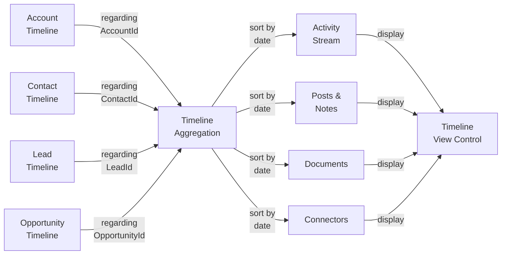

---

## SECTION 7 – Financial Calculation Flow

### 7.1 Pricing Calculation Flow

```mermaid
flowchart TD
    %% ==================== PRICING ENGINE ====================
    
    START(("Pricing<br/>Calculation"))
    
    %% Product Pricing
    PRODUCT["Product<br/>Selection"]
    PRICELIST["Price List<br/>Lookup"]
    GET_PRICE["Get Unit<br/>Price"]
    
    %% Line Item
    LINE_QTY["Enter<br/>Quantity"]
    LINE_PRICE["Unit Price"]
    LINE_CALC["Calculate<br/>Line Amount"]
    LINE_AMOUNT["Line Amount<br/>(Qty × Price)"]
    
    %% Discounts
    LINE_DISCOUNT["Line Discount<br/>%"]
    DISCOUNT_CALC["Calculate<br/>Discount"]
    DISCOUNT_AMT["Discount<br/>Amount"]
    NET_LINE["Net Line<br/>(Amount - Discount)"]
    
    %% Extended Pricing
    TOTAL_LINES["Sum All<br/>Lines"]
    SUBTOTAL["Subtotal"]
    
    ORDER_DISCOUNT["Order Discount<br/>% or Amount"]
    ORDER_DISCOUNT_CALC["Calculate Order<br/>Discount"]
    ORDER_DISCOUNT_AMT["Discount Amount"]
    NET_SUBTOTAL["Net Subtotal"]
    
    %% Additional Costs
    FREIGHT["Freight<br/>Amount"]
    TAX_CALC["Calculate<br/>Tax"]
    TAX_AMT["Tax Amount"]
    
    %% Final Total
    TOTAL_CALC["Calculate<br/>Total"]
    TOTAL_AMOUNT["Total Amount"]
    
    %% Base Currency
    TRANSACTION_CURRENCY["Transaction<br/>Currency"]
    EXCHANGE_RATE["Exchange<br/>Rate"]
    CONVERT["Convert to<br/>Base Currency"]
    BASE_AMOUNT["Base Currency<br/>Amount"]
    
    %% Connections
    START --> PRODUCT
    PRODUCT --> PRICELIST
    PRICELIST --> GET_PRICE
    
    GET_PRICE --> LINE_PRICE
    LINE_QTY --> LINE_CALC
    LINE_PRICE --> LINE_CALC
    LINE_CALC --> LINE_AMOUNT
    
    LINE_AMOUNT --> LINE_DISCOUNT
    LINE_DISCOUNT --> DISCOUNT_CALC
    DISCOUNT_CALC --> DISCOUNT_AMT
    DISCOUNT_AMT --> NET_LINE
    
    NET_LINE --> TOTAL_LINES
    TOTAL_LINES --> SUBTOTAL
    
    SUBTOTAL --> ORDER_DISCOUNT
    ORDER_DISCOUNT --> ORDER_DISCOUNT_CALC
    ORDER_DISCOUNT_CALC --> ORDER_DISCOUNT_AMT
    ORDER_DISCOUNT_AMT --> NET_SUBTOTAL
    
    NET_SUBTOTAL --> FREIGHT
    FREIGHT --> TAX_CALC
    TAX_CALC --> TAX_AMT
    
    TAX_AMT --> TOTAL_CALC
    TOTAL_CALC --> TOTAL_AMOUNT
    
    TOTAL_AMOUNT --> TRANSACTION_CURRENCY
    TRANSACTION_CURRENCY --> EXCHANGE_RATE
    EXCHANGE_RATE --> CONVERT
    CONVERT --> BASE_AMOUNT
    
    class START,TOTAL_AMOUNT,BASE_AMOUNT fill:#e3f2fd,stroke:#1565c0
    class PRODUCT,PRICELIST,GET_PRICE fill:#c8e6c9,stroke:#2e7d32
    class LINE_QTY,LINE_PRICE,LINE_CALC fill:#fff8e1,stroke:#ff8f00
    class DISCOUNT_AMT,ORDER_DISCOUNT_AMT,TAX_AMT fill:#fce4ec,stroke:#c2185b
    class SUBTOTAL,NET_SUBTOTAL fill:#f3e5f5,stroke:#7b1fa2
```

### 7.2 Rollup Calculation Flow

```mermaid
flowchart TD
    %% ==================== OPPORTUNITY ROLLUP ====================
    
    OPP_HEADER["Opportunity<br/>Header"]
    
    subgraph LINE_ITEMS["Opportunity Products"]
        LP1["Line Item 1"]
        LP2["Line Item 2"]
        LP3["Line Item N"]
    end
    
    CALCULATE["Calculate<br/>Totals"]
    EXTENDED_AMT["Extended Amount<br/>(Qty × Price)"]
    LINE_DISC["Line Discount"]
    LINE_TAX["Tax"]
    
    AGGREGATE["Aggregate to<br/>Opportunity"]
    
    TOTAL_LINE_AMT["Total Line<br/>Amount"]
    TOTAL_DISC["Total Discount"]
    TOTAL_TAX["Total Tax"]
    
    OTHER_CHARGES["Freight &<br/>Other Charges"]
    
    OPP_TOTAL["Opportunity<br/>Total Amount"]
    
    OPP_UPDATE["Update<br/>Opportunity"]
    
    OPPORTUNITY["Opportunity<br/>Entity"]
    
    %% Flow
    OPP_HEADER --> LINE_ITEMS
    
    LP1 --> CALCULATE
    LP2 --> CALCULATE
    LP3 --> CALCULATE
    
    CALCULATE --> EXTENDED_AMT
    EXTENDED_AMT --> LINE_DISC
    LINE_DISC --> LINE_TAX
    
    LINE_ITEMS -->|"all lines"| AGGREGATE
    AGGREGATE -->|"sum| TOTAL_LINE_AMT
    AGGREGATE -->|"sum| TOTAL_DISC
    AGGREGATE -->|"sum| TOTAL_TAX
    
    TOTAL_LINE_AMT --> OTHER_CHARGES
    TOTAL_DISC --> OTHER_CHARGES
    TOTAL_TAX --> OTHER_CHARGES
    
    OTHER_CHARGES --> OPP_TOTAL
    
    OPP_TOTAL --> OPP_UPDATE
    OPP_UPDATE --> OPPORTUNITY
    
    class OPP_HEADER,OPPORTUNITY fill:#e3f2fd,stroke:#1565c0
    class LP1,LP2,LP3,CALCULATE fill:#c8e6c9,stroke:#2e7d32
    class TOTAL_LINE_AMT,TOTAL_DISC,TOTAL_TAX,OPP_TOTAL fill:#fff8e1,stroke:#ff8f00
    class AGGREGATE,OPP_UPDATE fill:#fce4ec,stroke:#c2185b
```

### 7.3 Multi-Currency Conversion Flow

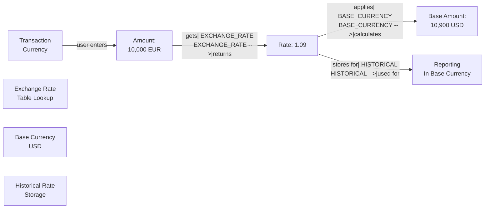

---

*Document generated by Senior Microsoft Dynamics 365 CRM Solution Architect & Dataverse Database Expert*
*All diagrams follow Enterprise Dynamics 365 / Dataverse architecture patterns*
